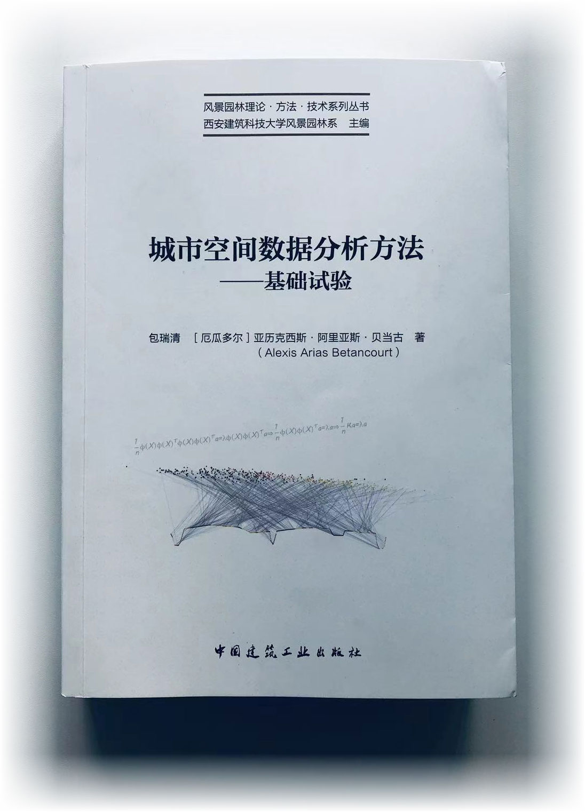
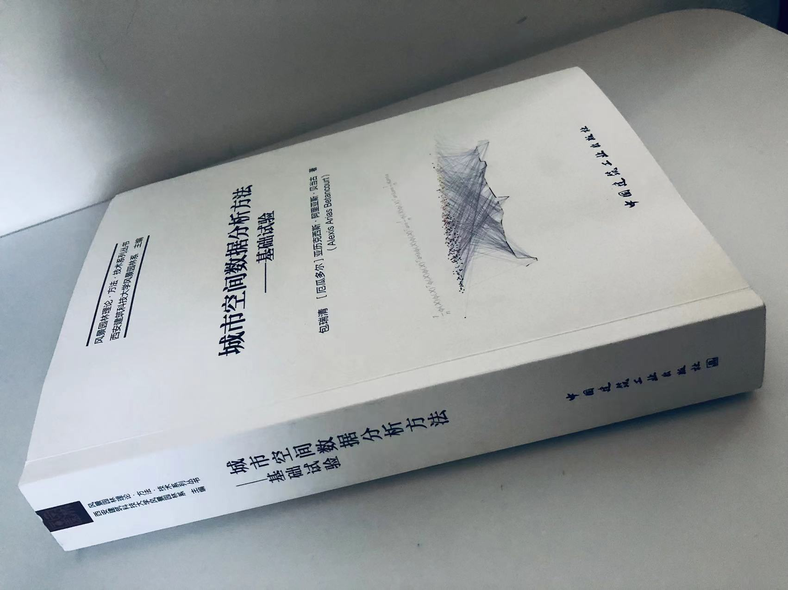
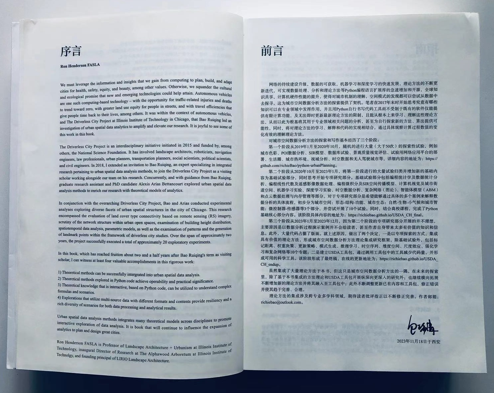
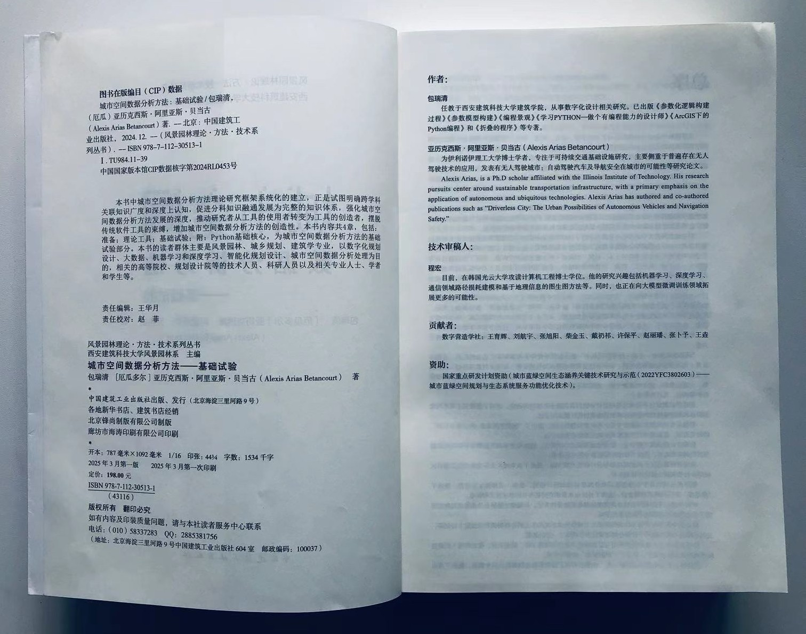

# 城市空间数据分析方法

|   |   |
|---|---|
|    | |
|    | |

#### 作者：

**包瑞清**

任教于西安建筑科技大学建筑学院，从事数字化设计相关研究。已出版《参数化逻辑构建过程》、《参数模型构建》、《编程景观》、《学习PYTHON—做个有编程能力的设计师》、《ArcGIS下的Python编程》和《折叠的程序》等专著。

**Alexis Arias Betancourt**

Alexis Arias, is a Ph.D scholar affiliated with the Illinois Institute of Technology. His research pursuits center around sustainable transportation infrastructure, with a primary emphasis on the application of autonomous and ubiquitous technologies. Alexis Arias has authored and co-authored publications such as "Driverless City: The Urban Possibilities of Autonomous Vehicles and Navigation Safety."

#### 技术审稿人：

**程宏**

程宏，目前在韩国光云大学攻读计算机工程博士学位。他的研究兴趣包括机器学习、深度学习、通信领域路径损耗建模和基于地理信息的图生图方法等。同时，也正在向大模型微调训练领域拓展更多的可能性。

#### 贡献者：

数字营造学社:王育辉、刘航宇、张旭阳、柴金玉、戴礽祁、许保平、赵丽璠、张卜予、王垚

#### 资助：

国家重点研发计划资助（城市蓝绿空间生态涵养关键技术研究与示范（2022YFC3802603）—— 城市蓝绿空间规划与生态系统服务功能优化技术）；

西北脆弱景观生态规划团队资助；

西安建筑科技大学风景园林学科建设经费资助。

