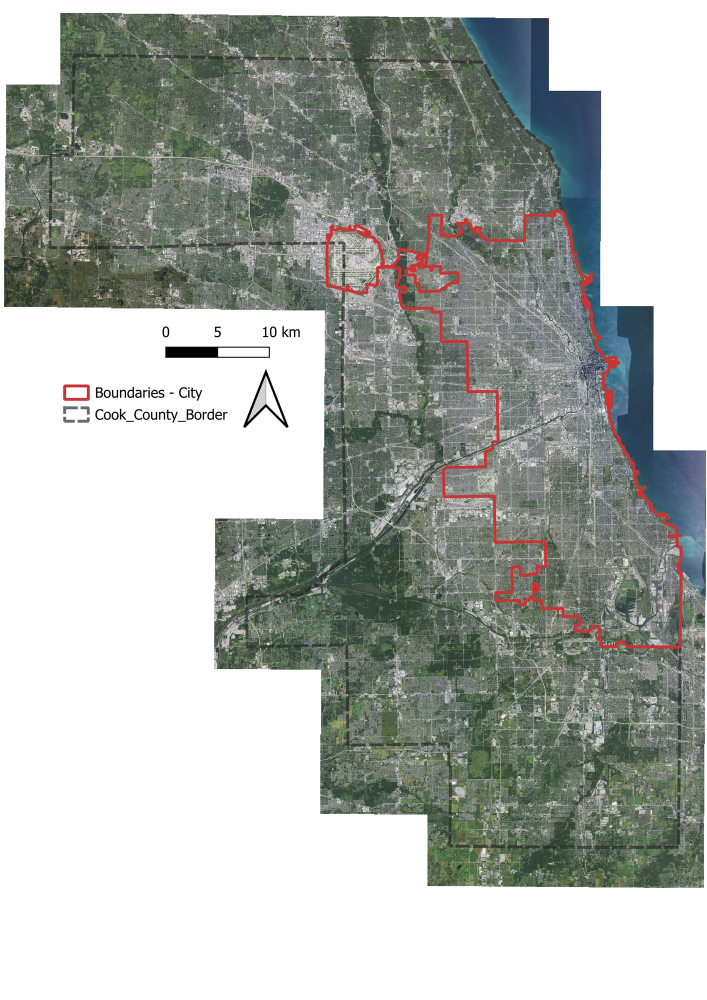
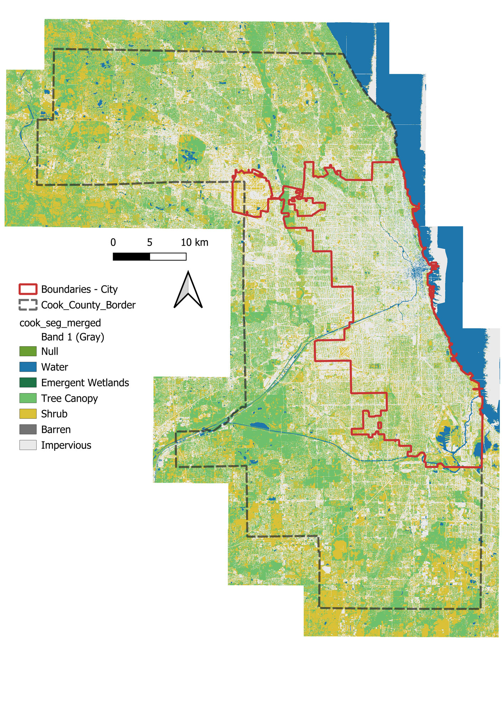
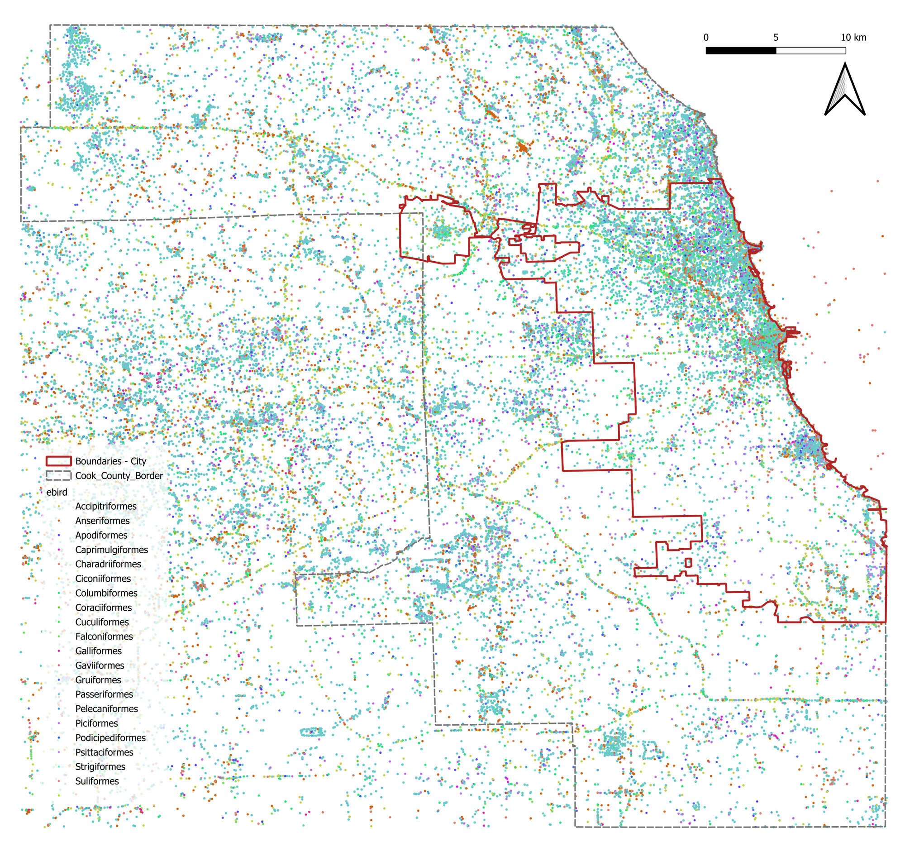
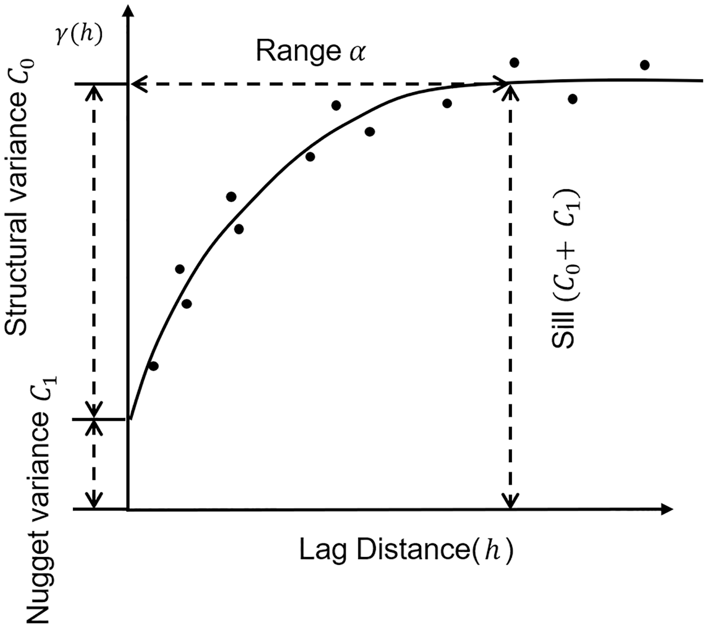

> Created on Sat Jul 29 08:06:41 2023 @author: Richie Bao-caDesign设计(cadesign.cn)

# 3.8 尺度效应

## 3.8.1 数据下载及预处理

### 3.8.1.1 芝加哥 NAIP（0.6m）高分辨率航拍影像生成土地覆盖（land cover，LC）数据

NAIP 航拍影像下载和解译的具体解释可以参考*NAIP航拍影像与分割模型库及Colaboratory和Planetary Computer Hub*部分，本章使用包含芝加哥城的伊利诺伊州库克郡（Illinois | Cook County）区域的 NAIP 影像。语义分割直接使用参考部分已经训练好的分割模型。

对大范围高分辨率影像数据处理需要注意内存管理，避免内存溢出，一方面，语义分割生成 LC 时，逐个瓦片的数据处理方式，避免一次性读取整个区域的数据；另一方面，合并 LC 所有瓦片时，使用[GDAL](https://gdal.org/drivers/raster/vrt.html)库的虚拟格式 VRT（Virtual Format）。VRT 驱动是 GDAL 的格式驱动程序，允许通过重新定位，应用潜在的算法，及修改或增加各种元数据，从其它 GDAL 数据集组成虚拟 GDAL 数据集。虚拟数据集的 VRT 描述可以以 XML 格式保存，其扩展名通常为 .vrt。VRT 支持栅格数据集（GDAL）也支持矢量数据集（OGR）。虚拟栅格 VRT 可以将多个栅格组合到一个文件中，实现整个栅格数据集的可视化。VRT 文件列出了数据集中每个栅格的元数据，例如文件位置、波段数、数据类型和栅格及栅格单元大小等。根据请求通过对源栅格的引用创建栅格单元值，使得源数据只有在需要时才参与计算，延迟了计算性的密集处理，因此减小了生成的中间文件大小，这有利于创建大型数据集<sup>[VRT -- GDAL Virtual Format, <https://gdal.org/drivers/raster/vrt.html#vrt-gdal-virtual-format>.]</sup>。

#### 1） 下载库克区域的 NAIP 航拍影像

在[Google Colaboratory，CoLab](https://colab.research.google.com/?utm_source=scs-index)中，结合使用 [Google Drive](https://www.google.com/drive/) 完成 NAIP 航拍影像数据的下载。必要的边界文件预先传上云端。

* 首先在 CoLab 中安装需要的库，并调入所需模块。


```python
%pip install torchgeo pystac_client planetary_computer
%pip install usda rioxarray rasterstats
```


```python
import usda.utils as usda_utils
import usda.geodata_process as usda_geodataProcess

import os
import geopandas as gpd
from torchgeo.datasets.utils import download_url
from IPython.display import Image
import pystac_client
import planetary_computer
from shapely.geometry import shape
import numpy as np
```

* 链接 Google Drive，用于将数据下载到云端。


```python
from google.colab import drive
drive.mount('/content/gdrive')
```

* 定义必要的参数，例如文件读写路径等。


```python
__C=usda_utils.AttrDict()
args=__C

__C.workspace='/content/gdrive/MyDrive/dataset/naip_cook'

__C.data=usda_utils.AttrDict()
__C.data.cook_border=os.path.join(args.workspace,'Cook_County_Border.geojson') # 库克郡边界
__C.data.chicago_boundary=os.path.join(args.workspace,'Boundaries - City.geojson') # 芝加哥城边界
__C.data.naip_dir=os.path.join(args.workspace,'imgs') # 航拍影像下载保存文件夹
__C.data.items_info_fn=os.path.join(args.workspace,'items_info.geojson') # 航拍影像下载，包括索引、ID、时间、下载地址和对应的瓦片边界等
```

* 在[Planetary Computer，PC](https://planetarycomputer.microsoft.com/)上，根据给定的边界搜索数据。

因为库克郡边界相对复杂，如果直接用于影像检索，会发生错误，因此先提取其外接矩形，用该矩形检索后，再根据库克郡边界提取内部及与其相交的影像编号用于下载。

-提取外接矩形


```python
cookcounty_border=gpd.read_file(args.data.cook_border)
cookcounty_border_envelope=cookcounty_border.envelope
cookcounty_border_envelope
```


定义`planetary_computer_items_filter4download()`方法，给定参数`border`，下载指定范围内的影像数据。


```python
items_gdf=usda_geodataProces.planetary_computer_items_filter4download(items,border=cookcounty_border.geometry[0])
items_gdf=usda_geodataProces.drop_overlapping_polygons(items_gdf)
```

下载时，记录了如下各影像瓦片的信息，方便查看。


```python
items_gdf=gpd.read_file(args.data.items_info_fn)
items_gdf.tail(2)
```


  <div id="df-3ef906a4-f974-4b35-b1aa-e9ce3e2d552d">
    <div class="colab-df-container">
      <div>
<style scoped>
    .dataframe tbody tr th:only-of-type {
        vertical-align: middle;
    }

    .dataframe tbody tr th {
        vertical-align: top;
    }

    .dataframe thead th {
        text-align: right;
    }
</style>
<table border="1" class="dataframe">
  <thead>
    <tr style="text-align: right;">
      <th></th>
      <th>idx</th>
      <th>id</th>
      <th>datetime</th>
      <th>url</th>
      <th>geometry</th>
    </tr>
  </thead>
  <tbody>
    <tr>
      <th>96</th>
      <td>143</td>
      <td>il_m_4208749_sw_16_060_20210905</td>
      <td>2021-09-05 16:00:00+00:00</td>
      <td>https://naipeuwest.blob.core.windows.net/naip/...</td>
      <td>POLYGON ((-87.93239 42.12233, -87.93340 42.191...</td>
    </tr>
    <tr>
      <th>97</th>
      <td>144</td>
      <td>il_m_4208749_se_16_060_20210905</td>
      <td>2021-09-05 16:00:00+00:00</td>
      <td>https://naipeuwest.blob.core.windows.net/naip/...</td>
      <td>POLYGON ((-87.87046 42.12233, -87.87141 42.191...</td>
    </tr>
  </tbody>
</table>
</div>
      <button class="colab-df-convert" onclick="convertToInteractive('df-3ef906a4-f974-4b35-b1aa-e9ce3e2d552d')"
              title="Convert this dataframe to an interactive table."
              style="display:none;">

  <svg xmlns="http://www.w3.org/2000/svg" height="24px"viewBox="0 0 24 24"
       width="24px">
    <path d="M0 0h24v24H0V0z" fill="none"/>
    <path d="M18.56 5.44l.94 2.06.94-2.06 2.06-.94-2.06-.94-.94-2.06-.94 2.06-2.06.94zm-11 1L8.5 8.5l.94-2.06 2.06-.94-2.06-.94L8.5 2.5l-.94 2.06-2.06.94zm10 10l.94 2.06.94-2.06 2.06-.94-2.06-.94-.94-2.06-.94 2.06-2.06.94z"/><path d="M17.41 7.96l-1.37-1.37c-.4-.4-.92-.59-1.43-.59-.52 0-1.04.2-1.43.59L10.3 9.45l-7.72 7.72c-.78.78-.78 2.05 0 2.83L4 21.41c.39.39.9.59 1.41.59.51 0 1.02-.2 1.41-.59l7.78-7.78 2.81-2.81c.8-.78.8-2.07 0-2.86zM5.41 20L4 18.59l7.72-7.72 1.47 1.35L5.41 20z"/>
  </svg>
      </button>


    <div id="df-6d9e73b2-1e83-4c8f-964b-8ec24347015c">
      <button class="colab-df-quickchart" onclick="quickchart('df-6d9e73b2-1e83-4c8f-964b-8ec24347015c')"
              title="Suggest charts."
              style="display:none;">

<svg xmlns="http://www.w3.org/2000/svg" height="24px"viewBox="0 0 24 24"
     width="24px">
    <g>
        <path d="M19 3H5c-1.1 0-2 .9-2 2v14c0 1.1.9 2 2 2h14c1.1 0 2-.9 2-2V5c0-1.1-.9-2-2-2zM9 17H7v-7h2v7zm4 0h-2V7h2v10zm4 0h-2v-4h2v4z"/>
    </g>
</svg>
      </button>
    </div>

<style>
  .colab-df-quickchart {
    background-color: #E8F0FE;
    border: none;
    border-radius: 50%;
    cursor: pointer;
    display: none;
    fill: #1967D2;
    height: 32px;
    padding: 0 0 0 0;
    width: 32px;
  }

  .colab-df-quickchart:hover {
    background-color: #E2EBFA;
    box-shadow: 0px 1px 2px rgba(60, 64, 67, 0.3), 0px 1px 3px 1px rgba(60, 64, 67, 0.15);
    fill: #174EA6;
  }

  [theme=dark] .colab-df-quickchart {
    background-color: #3B4455;
    fill: #D2E3FC;
  }

  [theme=dark] .colab-df-quickchart:hover {
    background-color: #434B5C;
    box-shadow: 0px 1px 3px 1px rgba(0, 0, 0, 0.15);
    filter: drop-shadow(0px 1px 2px rgba(0, 0, 0, 0.3));
    fill: #FFFFFF;
  }
</style>

    <script>
      async function quickchart(key) {
        const containerElement = document.querySelector('#' + key);
        const charts = await google.colab.kernel.invokeFunction(
            'suggestCharts', [key], {});
      }
    </script>

      <script>

function displayQuickchartButton(domScope) {
  let quickchartButtonEl =
    domScope.querySelector('#df-6d9e73b2-1e83-4c8f-964b-8ec24347015c button.colab-df-quickchart');
  quickchartButtonEl.style.display =
    google.colab.kernel.accessAllowed ? 'block' : 'none';
}

        displayQuickchartButton(document);
      </script>
      <style>
    .colab-df-container {
      display:flex;
      flex-wrap:wrap;
      gap: 12px;
    }

    .colab-df-convert {
      background-color: #E8F0FE;
      border: none;
      border-radius: 50%;
      cursor: pointer;
      display: none;
      fill: #1967D2;
      height: 32px;
      padding: 0 0 0 0;
      width: 32px;
    }

    .colab-df-convert:hover {
      background-color: #E2EBFA;
      box-shadow: 0px 1px 2px rgba(60, 64, 67, 0.3), 0px 1px 3px 1px rgba(60, 64, 67, 0.15);
      fill: #174EA6;
    }

    [theme=dark] .colab-df-convert {
      background-color: #3B4455;
      fill: #D2E3FC;
    }

    [theme=dark] .colab-df-convert:hover {
      background-color: #434B5C;
      box-shadow: 0px 1px 3px 1px rgba(0, 0, 0, 0.15);
      filter: drop-shadow(0px 1px 2px rgba(0, 0, 0, 0.3));
      fill: #FFFFFF;
    }
  </style>

      <script>
        const buttonEl =
          document.querySelector('#df-3ef906a4-f974-4b35-b1aa-e9ce3e2d552d button.colab-df-convert');
        buttonEl.style.display =
          google.colab.kernel.accessAllowed ? 'block' : 'none';

        async function convertToInteractive(key) {
          const element = document.querySelector('#df-3ef906a4-f974-4b35-b1aa-e9ce3e2d552d');
          const dataTable =
            await google.colab.kernel.invokeFunction('convertToInteractive',
                                                     [key], {});
          if (!dataTable) return;

          const docLinkHtml = 'Like what you see? Visit the ' +
            '<a target="_blank" href=https://colab.research.google.com/notebooks/data_table.ipynb>data table notebook</a>'
            + ' to learn more about interactive tables.';
          element.innerHTML = '';
          dataTable['output_type'] = 'display_data';
          await google.colab.output.renderOutput(dataTable, element);
          const docLink = document.createElement('div');
          docLink.innerHTML = docLinkHtml;
          element.appendChild(docLink);
        }
      </script>
    </div>
  </div>


叠合打印库克郡边界、芝加哥城边界和下载的各个影像边界信息，核实下载的影像是否正确。


```python
chicago_boundary_gdf=gpd.read_file(args.data.chicago_boundary)

ax=items_gdf.boundary.plot()
cookcounty_border.boundary.plot(color='red',ax=ax)
chicago_boundary_gdf.boundary.plot(color='k',ax=ax);
```

将下载的信息写入至本地磁盘。


```python
items_gdf.to_file(args.data.items_info_fn)
```

在 QGIS 中查看下载的库克区域 NAIP 航拍影像。

 

#### 2） 用已训练的分割模型解译

调用*分割模型库及Colaboratory和Planetary Computer Hub*部分已经训练的分割模型参数，

1. 首先需要对应训练时的数据配置处理影像；
2. 并建立神经网络模型后加载预训练的模型参数；
3. 最后进行分割预测；
4. 将预测的各个影像瓦片转化为 GeoTIFF 格式栅格文件；
5. 合并分割图像。

* 构建数据集和数据加载器

> [GDAL](https://gdal.org/index.html)库安装时，如果直接`pip install gdal`或者`conda install -c conda-forge gdal`安装后调用出现报错， 可以从[Archived: Unofficial Windows Binaries for Python Extension Packages](https://www.lfd.uci.edu/~gohlke/pythonlibs/)下载对应版本的安装包至本地安装。


```python
from torchvision.transforms import Compose
from torchgeo.transforms import AugmentationSequential
from torchgeo.samplers import PreChippedGeoSampler
from torchgeo.datasets import stack_samples 
from torch.utils.data import DataLoader

import matplotlib.pyplot as plt
import torchvision.transforms as T
from torchgeo.trainers import SemanticSegmentationTask
import numpy as np
from tqdm import tqdm
import itertools
import rioxarray as rxr
import glob
import os
from tqdm import tqdm
from rasterio.plot import show
```

影像数据预处理的图像变换部分，有数据标准化、增加 NDVI 信息等。


```python
ndvi=usda_geodataProcess.AppendNDVI(index_nir=3, index_red=0)
ndwi=usda_geodataProcess.AppendNDWI(index_green=1, index_nir=3)

naip_transforms=Compose([
    usda_geodataProces.naip_preprocess,
    usda_geodataProces.remove_bbox,
    AugmentationSequential(ndvi,data_keys=["image"])
    ])
```

构建数据集和数据加载器。[TorchGeo](https://torchgeo.readthedocs.io/en/stable/api/samplers.html)库提供了多种数据采样器，训练时通常使用`RandomGeoSampler`随机采样方法，最大化数据集尽可能返回更多的随机样本；预测时如果单一影像瓦片数据量大造成内存溢出，通常用`GridGeoSampler`方法，将单一影像数据按照指定网格大小切分后逐一预测后再拼接；本次实验 NAIP 单个影像瓦片的大小约为 $12564 \times 9683$，使用 64G 内存基本可以完成单一瓦片的预测，因此使用`PreChippedGeoSampler`方法构建数据加载器，每次一次性预测整幅影像。


```python
naip_cook_dir=r'D:\datasets\naip_cook'
X_naip=usda_geodataProcess.NAIP(naip_cook_dir,transforms=naip_transforms)
X_sampler=PreChippedGeoSampler(X_naip)
X_dataloader=DataLoader(X_naip,sampler=X_sampler, collate_fn=stack_samples,batch_size=1,shuffle=False)
```

因为相对 64G 内存，未切分的整幅影像压在内存溢出线上，有时会造成内存溢出停止循环预测，因此需要从停止的影像索引位置继续预测。切分数据加载器的方法可以用`itertools`库提供的`islice`方法实现。


```python
idx_restart=70
X_dataloader=itertools.islice(X_dataloader, idx_restart, None)
```

可以用返回的数据集属性`filepath_lst`查看对应影像的文件路径。


```python
naip_fns=(X_naip.filepath_lst)
print(f'{len(naip_fns)}\n{naip_fns[:3]}')
```

查看数据加载器中的一幅影像。


```python
for batch in X_dataloader:
    img=batch['image']    
    break   
    
X_,pad_ex=usda_geodataProcess.img_size_expand_topNright(img,base=32)
print(f'{img.shape}\n{X_.shape}\n{pad_ex}')
plt.imshow(T.ToPILImage()(X_[0][:3])); 
```

* 构建分割网络模型

配置参数同训练时的参数，直接迁移训练时的定义，并加载训练的模型参数。


```python
aux_params=dict(
    pooling='avg',             # one of 'avg', 'max'
    dropout=0.5,               # dropout ratio, default is None
    activation='sigmoid',      # activation function, default is None
    )

task=SemanticSegmentationTask(
    model='unet',
    backbone='resnet34',
    weights='imagenet',
    pretrained=True,
    in_channels=5, 
    num_classes=8,
    ignore_index=0,
    loss='ce', # 'jaccard'
    learning_rate=0.1,
    learning_rate_schedule_patience=5,
    aux_params=aux_params,
    )

trained_model_fn=r'C:\Users\richie\omen_richiebao\omen_github\model_trained\naipNDelawareSeg_last.ckpt'
unet_model=task.load_from_checkpoint(trained_model_fn)
unet_model.freeze()
```

* 预测并转化为栅格数据保存

试验性预测其中一幅图像，确定无误后循环预测全部影像。


```python
y_probs=unet_model(X_)
print(y_probs.shape)
y_pred=np.argmax(y_probs,axis=1)
print(y_pred.shape,'\n',y_pred,'\n',y_pred.unique())
```


```python
LC_color_dict=usda_geodataProcess.Seg_config.LC_color_dict
cmap_LC,norm=usda_geodataProcess.cmap4LC(LC_color_dict,list(np.unique(y_pred))) 
cmap_LC
```

查看预测结果。


```python
fig,ax=plt.subplots(figsize=(20,20))
ax.imshow(np.squeeze(y_pred),cmap=cmap_LC)
plt.show()
```

循环预测所有影像，同时定义`segarray2tiff()`方法将预测结果转化为栅格保存至本地磁盘。


```python
seg_save_dir=r'D:\datasets\naip_seg' 

completed_fn_lst=[]
i=0
for batch in tqdm(X_dataloader):
    img=batch['image']        
    X_,_=usda_geodataProcess.img_size_expand_topNright(img,base=32)
    y_probs=unet_model(X_)
    y_pred=np.argmax(y_probs,axis=1)
    img_fn=X_naip.filepath_lst[idx_restart:][i]
    usda_geodataProcess.segarray2tiff(y_pred, img_fn, seg_save_dir) 
    completed_fn_lst.append(img_fn)
    i+=1
    try:
        del img, X_, y_pred, y_probs
    except:
        pass
```

* 合并预测的分割栅格数据

因为分割栅格数据类型为 `int32`，如果`GDAL`库的版本不支持读取该类型，则需要将其降低为`int8`。


```python
seg_dir=r'D:\datasets\naip_seg' 
seg_int8_dir=r'D:\datasets\naip_seg_int8'

fn_lst=glob.glob(os.path.join(seg_dir,'*.tif'))
for fn in tqdm(fn_lst):
    src=rxr.open_rasterio(fn)
    src.rio.to_raster(os.path.join(seg_int8_dir,os.path.basename(fn)),driver='GTiff',dtype='int8')
```

定义`raster_mosaic_vrt`方法合并分割数据。


```python
seg_merged_fn=r'D:\datasets\cook_seg_merged.tif'    
usda_geodataProces.raster_mosaic_vrt(seg_int8_dir,seg_merged_fn,xRes=0.6,yRes=0.6)  
```

在 QGIS 中查看合并后的分割数据。

 

### 3.8.1.2 观测鸟分布数据——eBird Basic Dataset (EBD)

[eBird](https://ebird.org/home) 项目从每个观鸟者都有其独特的知识和经验的简单想法出发，以鸟类清单的形式收集这些信息为目标，存档并分享，推动面向科学、保护和教育新的数据驱动方法。eBird 开发有配套的工具，使观测鸟更具有价值，例如管理列表、照片和录音，到物种分布的实时地图，及观察到鸟类时的通报，提供最新和有用的信息。eBird 是世界上最大的与生物多样性相关的可续项目之一，全球每年有超过 1 亿的鸟类目击事件由 eBird 的贡献者提供，平均参与增长率约为每年 20%。eBird 是有数百个合作伙伴组织、数千名地区专家和数十万用户的协作企业，由康奈尔鸟类实验室（Cornell Lab of Ornithology）管理。通过在一个简单、科学的框架内收集的清单数据，eBird 记录鸟类的分布、丰富和生境及趋势。观测者输入他们观鸟的时间、地点和方式，然后填写一份清单，列出在郊游期间看到和听到的所有鸟类。eBird 提供的免费移动应用程序允许在世界任何地方进行离线数据收集，并提供了许多方法来探索和总结来自全球 eBird 社区的数据及其观测结果。数据质量至关重要，当进入目击时，观察者会看到一份该日期和该地区可能出现的鸟类名录，这些名录是由世界上最有知识的鸟类分布专家开发。当看到不寻常的鸟类，或报告了高数量的鸟类时，地区专家会审查这些记录<sup>[About eBird, <https://ebird.org/about>.]</sup>。

从 [EBD](https://www.gbif.org/occurrence/download?dataset_key=4fa7b334-ce0d-4e88-aaae-2e0c138d049e) 下载观测数据时，使用前文库克郡外接矩形边界`AOI_json`值，为 GeoJSON 数据格式，复制值到下载页面 Location 标签下的 Geometry 子标签下，下载所有时间数据，压缩文件大小为 896MB，解压后的 CSV 格式文件为 4.17GB。下图为 EBD 下载页面。


```python
import usda.utils as usda_utils

import geopandas as gpd
import pandas as pd
```

读取和转化 eBird 数据为 GeoDataFrame 数据格式。首先读取为 DataFrame 数据格式。试验时所用内存大小为 64GB，满足读写时内存需求，如果内存较小，可以配合使用`pd.read_csv`方法提供的`chunksize`参数分批读取查看，或者用于拆分数据。


```python
s_t=usda_utils.start_time()

ebird_fn=r'D:\datasets\ebird\eBird_cook.csv'
ebird_df=pd.read_csv(ebird_fn,on_bad_lines='skip',sep='\t')
ebird_df.head(2)
```

    start time: 2023-08-13 11:36:54.534666
    


<div>
<style scoped>
    .dataframe tbody tr th:only-of-type {
        vertical-align: middle;
    }

    .dataframe tbody tr th {
        vertical-align: top;
    }

    .dataframe thead th {
        text-align: right;
    }
</style>
<table border="1" class="dataframe">
  <thead>
    <tr style="text-align: right;">
      <th></th>
      <th>gbifID</th>
      <th>datasetKey</th>
      <th>occurrenceID</th>
      <th>kingdom</th>
      <th>phylum</th>
      <th>class</th>
      <th>order</th>
      <th>family</th>
      <th>genus</th>
      <th>species</th>
      <th>...</th>
      <th>identifiedBy</th>
      <th>dateIdentified</th>
      <th>license</th>
      <th>rightsHolder</th>
      <th>recordedBy</th>
      <th>typeStatus</th>
      <th>establishmentMeans</th>
      <th>lastInterpreted</th>
      <th>mediaType</th>
      <th>issue</th>
    </tr>
  </thead>
  <tbody>
    <tr>
      <th>0</th>
      <td>1169395868</td>
      <td>4fa7b334-ce0d-4e88-aaae-2e0c138d049e</td>
      <td>URN:catalog:CLO:EBIRD:OBS251600139</td>
      <td>Animalia</td>
      <td>Chordata</td>
      <td>Aves</td>
      <td>Passeriformes</td>
      <td>Icteridae</td>
      <td>Agelaius</td>
      <td>Agelaius phoeniceus</td>
      <td>...</td>
      <td>NaN</td>
      <td>NaN</td>
      <td>CC_BY_4_0</td>
      <td>NaN</td>
      <td>obsr223391</td>
      <td>NaN</td>
      <td>NaN</td>
      <td>2023-06-07T15:02:30.183Z</td>
      <td>NaN</td>
      <td>CONTINENT_DERIVED_FROM_COORDINATES</td>
    </tr>
    <tr>
      <th>1</th>
      <td>1172197891</td>
      <td>4fa7b334-ce0d-4e88-aaae-2e0c138d049e</td>
      <td>URN:catalog:CLO:EBIRD:OBS254731795</td>
      <td>Animalia</td>
      <td>Chordata</td>
      <td>Aves</td>
      <td>Passeriformes</td>
      <td>Mimidae</td>
      <td>Dumetella</td>
      <td>Dumetella carolinensis</td>
      <td>...</td>
      <td>NaN</td>
      <td>NaN</td>
      <td>CC_BY_4_0</td>
      <td>NaN</td>
      <td>obsr261364</td>
      <td>NaN</td>
      <td>NaN</td>
      <td>2023-06-07T15:02:38.836Z</td>
      <td>NaN</td>
      <td>CONTINENT_DERIVED_FROM_COORDINATES</td>
    </tr>
  </tbody>
</table>
<p>2 rows × 50 columns</p>
</div>


查看字段和对应的一行数据。


```python
ebird_df.loc[0]
```


    gbifID                                                         1169395868
    datasetKey                           4fa7b334-ce0d-4e88-aaae-2e0c138d049e
    occurrenceID                           URN:catalog:CLO:EBIRD:OBS251600139
    kingdom                                                          Animalia
    phylum                                                           Chordata
    class                                                                Aves
    order                                                       Passeriformes
    family                                                          Icteridae
    genus                                                            Agelaius
    species                                               Agelaius phoeniceus
    infraspecificEpithet                                                  NaN
    taxonRank                                                         SPECIES
    scientificName                       Agelaius phoeniceus (Linnaeus, 1766)
    verbatimScientificName                                Agelaius phoeniceus
    verbatimScientificNameAuthorship                                      NaN
    countryCode                                                            US
    locality                            Montrose Point, Lincoln Park, Chicago
    stateProvince                                                    Illinois
    occurrenceStatus                                                  PRESENT
    individualCount                                                      10.0
    publishingOrgKey                     e2e717bf-551a-4917-bdc9-4fa0f342c530
    decimalLatitude                                                 41.963383
    decimalLongitude                                                -87.63442
    coordinateUncertaintyInMeters                                         NaN
    coordinatePrecision                                                   NaN
    elevation                                                             NaN
    elevationAccuracy                                                     NaN
    depth                                                                 NaN
    depthAccuracy                                                         NaN
    eventDate                                             2014-05-07T00:00:00
    day                                                                     7
    month                                                                   5
    year                                                                 2014
    taxonKey                                                          9409198
    speciesKey                                                        9409198
    basisOfRecord                                           HUMAN_OBSERVATION
    institutionCode                                                       CLO
    collectionCode                                                      EBIRD
    catalogNumber                                                OBS251600139
    recordNumber                                                          NaN
    identifiedBy                                                          NaN
    dateIdentified                                                        NaN
    license                                                         CC_BY_4_0
    rightsHolder                                                          NaN
    recordedBy                                                     obsr223391
    typeStatus                                                            NaN
    establishmentMeans                                                    NaN
    lastInterpreted                                  2023-06-07T15:02:30.183Z
    mediaType                                                             NaN
    issue                                  CONTINENT_DERIVED_FROM_COORDINATES
    Name: 0, dtype: object


将 DataFrame 格式数据转化为 GeoDataFrame 格式数据。


```python
ebird_gdf=gpd.GeoDataFrame(ebird_df, geometry=gpd.points_from_xy(ebird_df.decimalLongitude, ebird_df.decimalLatitude), crs="EPSG:4326")
usda_utils.duration(s_t)
```

    end time: 2023-08-13 11:39:51.408119
    Total time spend:2.93 minutes
    

可以将 eBird 数据写入为`geopandas`库支持的 SHP、GPKG、GeoJSON等数据格式，及 SQLite 数据库。本次实验存储为 GPKG 格式后，用 QGIS 打开观测数据。

> 通过用`geopandas`库存储下载区域 eBird 数据至本地磁盘，可知目前`geopandas`库对大型数据的读写速度支持并不友好，因此在后续试验时，仍旧先用`pandas`库读取为 DataFrame 格式数据后再转化为 GeoDataFrame 格式数据使用，从上述读取和转化时长来看，3 分钟左右在可接受的区间内。


```python
print(ebird_gdf.shape)
```

    (8718718, 51)
    


```python
ebird_gpkg_fn=r'D:\datasets\ebird\ebird_cook.gpkg'
ebird_gdf.to_file(ebird_gpkg_fn,driver='GPKG',layer='ebird')
```

在 QGIS 中打开查看 eBird 数据。



### 3.8.1.3 人口分布数据——[WorldPop](https://hub.worldpop.org/)

WorldPop 为一个跨学科应用研究小组，主要侧重于支持改进空间人口证据库（spatial demographic evidence base），使用经同行评议的研究方法用于构建关于人口分布、人口统计和动态高分辨率开源的地理空间数据，并将其应用于健康和发展应用，包括实现可持续发展目标。其使命是使决策者能够通过高质量的应用研究利用空间人口数据的驱动，实现一个世界的愿景，在这个世界里，每个人无论在哪里，都能参与决策<sup>[What is WorldPop?, <https://www.worldpop.org/>.]</sup>。

WorldPop 提供有多种数据集，涉及人口数量（Population Count）、人口密度（Population Density）、人口加权密度（Population Weight Density）、年龄和性别结构（Age and sex structure）等。本次试验下载的数据为 2020年，高空分辨率为 100m 的美国区域人口数量分布栅格数据。该数据的估计是使用多源数据，主要包括含 13 个类别 30m 高空分辨率的土地覆盖（Land Cover）、数字高程及其衍生的坡度数据、由 MODIS 17A3 估计的净初级生产力（ net primary productivity，NPP）、夜间灯光、年平均降水量和平均气温、及与人口存在相关的地理空间数据，如道路和水道网络、较大的水体、聚落或人口密集的地点、各种城市基础服务设施（如诊所、医院和学校）等作为解释变量，以精细的人口普查数据对数转换的人口密度（log transformed population density）为结果变量，用随机森林（Random Forest）构建预测模型，预测全球人口分布<sup>[Stevens FR, Gaughan AE, Linard C, Tatem AJ (2015) Disaggregating Census Data for Population Mapping Using Random Forests with Remotely-Sensed and Ancillary Data. PLoS ONE 10(2): e0107042. https://doi.org/10.1371/journal.pone.0107042]</sup>。

读取和打印查看库克郡区域的人口数量。


```python
us_pop_fn=r'D:\datasets\worldpop\usa_ppp_2020_UNadj_constrained.tif'
cook_border=r'D:\datasets\scale\Cook_County_Border.geojson'

cookcounty_border=gpd.read_file(cook_border)
cookcounty_border_envelope=cookcounty_border.envelope
cookcounty_border_envelope
left_bottom,right_top=usda_geodataProcess.find_boundingRectangle_coordis([cookcounty_border_envelope[0]])
LC_part,transform,ras_meta=usda_geodataProcess.rio_read_subset(us_pop_fn,[left_bottom,right_top]) 
LC_part[LC_part<0]=0
```


```python
plt.style.use('default')
fig, ax=plt.subplots(figsize=(10,10)) 
show(np.squeeze(LC_part),ax=ax,transform=transform,cmap='hot')
plt.show()
```


    

    


## 3.8.2 尺度的宽泛释义

景观生态学（landscape ecology）中的相关研究需要考虑尺度问题，这到20世纪80年代在生态学中得到广泛认识，例如样方大小对物种/区域关系的测量和识别的影响，并且发现，没有一个单一的时间和空间维度适用于所有生态问题的研究。尺度（scale）是指对象（object）或过程（process）的空间（spatial）或时间（temporal）维度。尺度通常以粒度（grain）和幅度（extent）为特征。粒度为给定的数据集可能的最佳空间分辨率级别；幅度为研究区域的大小或者时间跨度<sup>[Allen, T. F. H., & Starr, T. B. (1982). Hierarchy: Perspectives for Ecological Complexity. Retrieved from https://api.semanticscholar.org/CorpusID:55743947]</sup>。

## 3.8.2.1 栅格的粒度和幅度

栅格数据的粒度通常为栅格单元大小（cell size），例如前文下载的 NAIP 航拍影像数据及基于其预测的土地覆盖（landcover，LC）类型栅格数据的粒度约为 0.6m。下述试验则试图通过对 0.6m 粒度的 LC 数据粒度和幅度的变化进行比较观察。


```python
%load_ext autoreload 
%autoreload 2
import usda.geodata_process as usda_geodataProcess

import rioxarray as rxr
import numpy as np
import matplotlib.pyplot as plt
from tqdm import tqdm
from rasterio.plot import show
import shapely
import geopandas as gpd
import pandas as pd
```

    The autoreload extension is already loaded. To reload it, use:
      %reload_ext autoreload
    

读取 LC 栅格元数据，用其投影（CRS）信息变换样方左下角和右上角的经纬度坐标。


```python
seg_merged_fn=r'D:\datasets\cook_seg_merged.tif'   
LC=rxr.open_rasterio(seg_merged_fn)
grain_size=[round(i,3) for i in LC.rio.resolution()]
print(f'grain size (cell size)={grain_size}',)
LC
```

    grain size (cell size)=[0.6, -0.6]
    


在幅度变化上，选择了100、500、1000和1500等 4 个连续大小变化的样方。所有幅度固定样方左下角位置坐标，仅通过变化右上角坐标调整样方大小。通过各个样方，用定义的`rio_read_subset()`方法读取对应样方的 LC 栅格数据，返回的值有 LC 栅格值数组`LC`，变换信息`transform`，元数据`ras_meta`等，其中变换信息用于后续地图打印、[xarray](https://docs.xarray.dev/en/stable/)或[rioxarray](https://corteva.github.io/rioxarray/stable/)库中[DataArray](https://docs.xarray.dev/en/stable/user-guide/data-structures.html)格式数据重建。


```python
pt_leftBottom=[-87.840427, 41.876229]
pt_leftBottom_pj=usda_geodataProcess.pt_coordi_transform(4326,LC.rio.crs,pt_leftBottom)
ws=[100,500,1000,1500]
pt_rightTop_pj_lst=[]
for w in ws:    
    pt_rightTop_pj=[i+w for i in pt_leftBottom_pj] 
    pt_rightTop_pj_lst.append(pt_rightTop_pj)
```


```python
LC_extents=[]
for pt_rightTop_pj in tqdm(pt_rightTop_pj_lst):
    LC_part,transform,ras_meta=usda_geodataProcess.rio_read_subset(seg_merged_fn,[pt_leftBottom_pj,pt_rightTop_pj])  
    LC_part_info={'coordi':[pt_leftBottom_pj,pt_rightTop_pj],'LC':LC_part,'transform':transform,'ras_meta':ras_meta}  
    LC_extents.append(LC_part_info)
```

    100%|███████████████████████████████████████████████████| 4/4 [00:00<00:00, 10.83it/s]
    

为了打印 LC 地图时，在后一较大幅度地图中对应打印前一较小幅度边界，观察幅度对位关系，需要根据左下角和右上角坐标构建样方的几何矩形，并定义为`GeoDataFrame`格式数据。


```python
extend_shp_lst=[]
for pt_rightTop_pj in pt_rightTop_pj_lst:
    extend_shp_lst.append(shapely.box(*pt_leftBottom_pj,*pt_rightTop_pj))
extend_df=pd.DataFrame({'geometry':extend_shp_lst})
extend_gdf=gpd.GeoDataFrame(extend_df,geometry='geometry',crs=LC.rio.crs)
```

因为不同幅度的 LC 数据的粒度均为 0.6m，为了观察粒度的变化，定义`upNdownsampling()`方法实现重采样，包括上采样（upsampling）和下采样（downsampling）。配置下采样的比例有1/10、1/40和1/80等3个连续变化比例值，对应的栅格单元大小分别约为 6.0、25.0和50.0。对于 LC 数据的采样方法选择`mode`方式，选择所有采样点中出现次数最多的值。
|   |   |   |

定义的`upNdownsampling()`方法输入参数为`DataArray`数据格式，因此需要将各个幅度的 LC 数组转化为`DataArray`格式数据，定义`array2dataa下述打印结果中红色矩形为当前幅度的前一幅度样方边界。rray()`方法实现。 


```python
fig, axs = plt.subplots(4, 4,figsize=(20,20))
LC_color_dict=usda_geodataProcess.Seg_config.LC_color_dict
scale_factors=[1/10,1/40,1/80]

for ncol,LC_info_dict in enumerate(LC_extents):
    LC_part=LC_info_dict['LC']
    transform=LC_info_dict['transform']
    cmap_LC,norm=usda_geodataProcess.cmap4LC(LC_color_dict,list(np.unique(LC_part)))
    ax=axs[ncol,0]
    show(np.squeeze(LC_part),ax=ax,cmap=cmap_LC,transform=transform)
    if ncol>0:
        extend_gdf.iloc[[ncol-1]].plot(color='none',edgecolor='red',linewidth=3,ax=ax,linestyle='-')
    ax.set_title(f'extent={ws[ncol]}$^2$;grain size={grain_size}')   
    ax.tick_params(axis='x',labelrotation=90)

    xda=usda_geodataProcess.array2dataarray(LC_part,transform,crs=LC.rio.crs) 
    for nrow,scale_factor in enumerate(scale_factors):
        downsampled=usda_geodataProcess.upNdownsampling(xda,scale_factor)   
        ax_row=axs[ncol,nrow+1]
        d_transform=downsampled.rio.transform()
        cmap_LC,norm=usda_geodataProcess.cmap4LC(LC_color_dict,list(np.unique(downsampled)))
        show(np.squeeze(downsampled.data),ax=ax_row,cmap=cmap_LC,transform=d_transform)
        new_grain_size=[round(i,3) for i in downsampled.rio.resolution()]
        ax_row.set_title(f'extent={ws[ncol]}$^2$;grain size={new_grain_size}')  
        if ncol>0:  
            extend_gdf.iloc[[ncol-1]].plot(color='none',edgecolor='red',linewidth=3,ax=ax_row,linestyle='-')     
        ax_row.tick_params(axis='x',labelrotation=90)
        
plt.tight_layout()        
plt.show()
```


    

    


打印查看提供的所有采样方法。通常根据不同的数据类型、不同的分析目的选择适合的采样方式，例如土地覆盖类型分类数据以类型出现频数最多的为结果值（`mode`）相对合理；表达空气污染浓度、地表温度等连续值，取均值（`average`）、最小（`min`）或最大值（`max`）、分位数（`q1`、`q3`）或求和（`sum`）等都相对合理，需要根据分析目的进一步确定。


```python
from rasterio.enums import Resampling
print(Resampling.__doc__)
```

    Available warp resampling algorithms.
        
        Attributes
        ----------
        nearest
            Nearest neighbor resampling (default, fastest algorithm, worst interpolation quality).
        bilinear
            Bilinear resampling.
        cubic
            Cubic resampling.
        cubic_spline
            Cubic spline resampling.
        lanczos
            Lanczos windowed sinc resampling.
        average
            Average resampling, computes the weighted average of all non-NODATA contributing pixels.
        mode
            Mode resampling, selects the value which appears most often of all the sampled points.
        gauss
            Gaussian resampling, Note: not available to the functions in rio.warp.
        max
            Maximum resampling, selects the maximum value from all non-NODATA contributing pixels. (GDAL >= 2.0)
        min
            Minimum resampling, selects the minimum value from all non-NODATA contributing pixels. (GDAL >= 2.0)
        med
            Median resampling, selects the median value of all non-NODATA contributing pixels. (GDAL >= 2.0)
        q1
            Q1, first quartile resampling, selects the first quartile value of all non-NODATA contributing pixels. (GDAL >= 2.0)
        q3
            Q3, third quartile resampling, selects the third quartile value of all non-NODATA contributing pixels. (GDAL >= 2.0)
        sum
            Sum, compute the weighted sum of all non-NODATA contributing pixels. (GDAL >= 3.1)
        rms
            RMS, root mean square / quadratic mean of all non-NODATA contributing pixels. (GDAL >= 3.3)
        
        Notes
        ----------
        The first 8, 'nearest', 'bilinear', 'cubic', 'cubic_spline',
        'lanczos', 'average', 'mode', and 'gauss', are available for making
        dataset overviews.
    
        'max', 'min', 'med', 'q1', 'q3' are only supported in GDAL >= 2.0.0.
    
        'nearest', 'bilinear', 'cubic', 'cubic_spline', 'lanczos',
        'average', 'mode' are always available (GDAL >= 1.10).
    
        'sum' is only supported in GDAL >= 3.1.
    
        'rms' is only supported in GDAL >= 3.3.
    
        Note: 'gauss' is not available to the functions in rio.warp.
        
    

## 3.8.2.2 尺度的其它类型

除了栅格单元大小反应空间维度外，各类模型中表征空间尺度的参数实际上都是尺度的一种表现，例如聚类簇数量的配置（如`KMeans`）、空间距离参数的配置（如`DBSCAN`）、分类中邻元的数量（如`KNeighborsClassifier`），及卷积核的大小等。下面以 `DBSCAN` 距离聚类为例，通过配置参数`eps`不同大小值，观察聚类结果。


```python
from sklearn.cluster import DBSCAN
from tqdm import tqdm
import geopandas as gpd
import numpy as np
import pandas as pd
import matplotlib.pyplot as plt
import matplotlib
```


```python
ebird_gdf.tail(2)
```


<div>
<style scoped>
    .dataframe tbody tr th:only-of-type {
        vertical-align: middle;
    }

    .dataframe tbody tr th {
        vertical-align: top;
    }

    .dataframe thead th {
        text-align: right;
    }
</style>
<table border="1" class="dataframe">
  <thead>
    <tr style="text-align: right;">
      <th></th>
      <th>gbifID</th>
      <th>datasetKey</th>
      <th>occurrenceID</th>
      <th>kingdom</th>
      <th>phylum</th>
      <th>class</th>
      <th>order</th>
      <th>family</th>
      <th>genus</th>
      <th>species</th>
      <th>...</th>
      <th>dateIdentified</th>
      <th>license</th>
      <th>rightsHolder</th>
      <th>recordedBy</th>
      <th>typeStatus</th>
      <th>establishmentMeans</th>
      <th>lastInterpreted</th>
      <th>mediaType</th>
      <th>issue</th>
      <th>geometry</th>
    </tr>
  </thead>
  <tbody>
    <tr>
      <th>8718716</th>
      <td>3603005263</td>
      <td>4fa7b334-ce0d-4e88-aaae-2e0c138d049e</td>
      <td>URN:catalog:CLO:EBIRD:OBS1249791849</td>
      <td>Animalia</td>
      <td>Chordata</td>
      <td>Aves</td>
      <td>Strigiformes</td>
      <td>Strigidae</td>
      <td>Bubo</td>
      <td>Bubo virginianus</td>
      <td>...</td>
      <td>NaN</td>
      <td>CC_BY_4_0</td>
      <td>NaN</td>
      <td>obsr326014</td>
      <td>NaN</td>
      <td>NaN</td>
      <td>2023-06-07T15:29:49.508Z</td>
      <td>NaN</td>
      <td>CONTINENT_DERIVED_FROM_COORDINATES</td>
      <td>POINT (-87.86573 41.60509)</td>
    </tr>
    <tr>
      <th>8718717</th>
      <td>3641927714</td>
      <td>4fa7b334-ce0d-4e88-aaae-2e0c138d049e</td>
      <td>URN:catalog:CLO:EBIRD:OBS1273643367</td>
      <td>Animalia</td>
      <td>Chordata</td>
      <td>Aves</td>
      <td>Coraciiformes</td>
      <td>Alcedinidae</td>
      <td>Megaceryle</td>
      <td>Megaceryle alcyon</td>
      <td>...</td>
      <td>NaN</td>
      <td>CC_BY_4_0</td>
      <td>NaN</td>
      <td>obsr607938</td>
      <td>NaN</td>
      <td>NaN</td>
      <td>2023-06-07T15:18:17.410Z</td>
      <td>NaN</td>
      <td>CONTINENT_DERIVED_FROM_COORDINATES</td>
      <td>POINT (-87.54932 41.75883)</td>
    </tr>
  </tbody>
</table>
<p>2 rows × 51 columns</p>
</div>


构建$10000^2$大小的样方，提取该样方区域内观测鸟数据。


```python
pt_leftBottom=[-87.738802, 41.966790]
pt_leftBottom_pj=usda_geodataProcess.pt_coordi_transform(4326,LC.rio.crs,pt_leftBottom)
pt_rightTop_pj=[i+10000 for i in pt_leftBottom_pj]

quadrat_df=pd.DataFrame({'geometry':[shapely.box(*pt_leftBottom_pj,*pt_rightTop_pj)]})
quadrat_gdf=gpd.GeoDataFrame(quadrat_df,geometry='geometry',crs=LC.rio.crs)
```

提取的样方内数据约37万条。将提取的数据单独写入到本地磁盘，方便读取。


```python
ebird_gdf_prj=ebird_gdf.to_crs(LC.rio.crs)
quadrat=gpd.clip(ebird_gdf_prj,quadrat_gdf)
quadrat_fn=r'D:\datasets\ebird\ebird_quadrat.gpkg'
quadrat.to_file(quadrat_fn,driver='GPKG', layer='quadrat')
quadrat.shape
```


    (368556, 51)


```python
quadrat_fn=r'D:\datasets\ebird\ebird_quadrat.gpkg'
quadrat=gpd.read_file(quadrat_fn)
```

执行`DBSCAN`聚类，配置的`eps`有10、50和100m等3个两个样本之间的最大距离，如果两个样本之间的距离小于最大距离，则这两个样本归为一簇，一个样本为另一个的邻域。


```python
eps_lst=[10,50,100]
observed_pts=np.array([(x,y) for x,y in zip(quadrat['geometry'].x , quadrat['geometry'].y)])

clustering_labels={}
for eps in tqdm(eps_lst):
    clustering=DBSCAN(eps=eps, min_samples=3).fit(observed_pts)
    clustering_labels[eps]=clustering.labels_
```

    100%|███████████████████████████████████████████████████| 3/3 [04:23<00:00, 87.69s/it]
    

为了减小数据量，仅提取必要的列信息，并合并聚类结果为列。


```python
cols=['gbifID','kingdom','phylum','class','order','family','genus','species','scientificName','verbatimScientificName','locality','individualCount','eventDate','day','month','year','geometry']
quadrat_sel=quadrat[cols]
quadrat_cluster=pd.DataFrame.from_dict({f'cluster_{k}':v for k,v in clustering_labels.items()})
quadrat_sel_cluster=pd.concat([quadrat_sel,quadrat_cluster],axis=1)

quadrat_sel_cluster_fn=r'D:\datasets\ebird\quadrat_sel_cluster.gpkg'
quadrat_sel_cluster.to_file(quadrat_sel_cluster_fn,driver='GPKG', layer='cluster')
```

打印3个不同距离聚类结果，聚类簇的数量分别为2048，1289和669等不同的值，表明距离尺度对结果有影响。


```python
fig, axs = plt.subplots(1, 3,figsize=(20,6))
for idx,col in enumerate(['cluster_10','cluster_50','cluster_100']):
    unique_num=quadrat_sel_cluster[col].nunique()
    cmap = matplotlib.colors.ListedColormap (np.random.rand (unique_num,3))
    quadrat_sel_cluster.plot(column=col,ax=axs[idx],cmap=cmap,markersize=1)
    axs[idx].set_title(f'{col}:({unique_num})')

plt.show()
```


    

    


## 3.8.3 不同尺度作用结果的比较分析方法

* 分类数据

### 3.8.3.1 标记距离的尺度变化矩阵

同一幅度（分析范围同）不同尺度的栅格单元大小不同，长宽两个方向的栅格单元数不同，因此两个不同维度的矩阵比较时，使用*标记距离*中解释的类/簇大小直方图 （class/clump-size histogram）、共现关系（Co-occurrence）和层级分解（Hierarchical decomposition）等方法转化为同一维度矩阵后计算两两尺度间的距离。本次例举的方法为层级分解。

首先构建 5000m 的样方作为试验区域，提取 LC 数据。


```python
%load_ext autoreload 
%autoreload 2
from usda import pattern_signature as usda_signature
from usda import stats as usda_stats

import matplotlib.pyplot as plt
import seaborn as sns
from kneed import KneeLocator, DataGenerator
```

    The autoreload extension is already loaded. To reload it, use:
      %reload_ext autoreload
    


```python
pt_leftBottom=[-87.738802, 41.966790]
pt_leftBottom_pj=usda_geodataProcess.pt_coordi_transform(4326,LC.rio.crs,pt_leftBottom)
pt_rightTop_pj=[i+5000 for i in pt_leftBottom_pj]
LC_part,transform,ras_meta=usda_geodataProcess.rio_read_subset(seg_merged_fn,[pt_leftBottom_pj,pt_rightTop_pj])  
```

降采样时，按缩放比例构建了144个连续变化值。因为栅格单元数为整数值，因此部分比例值缩放后具有相同的尺度大小，例如 $5000*(1/101)=49.504$和$5000*(1/102)=49.019$，向下取整时均为49。这从下述打印的图表中就可观察到这一现象。


```python
scale_factors=[1/(10*i) for i in range(1,145,1)] 
downsampled_dict={}
xda=usda_geodataProcess.array2dataarray(LC_part,transform,crs=LC.rio.crs) 
for nrow,scale_factor in enumerate(scale_factors):
    downsampled=usda_geodataProcess.upNdownsampling(xda,scale_factor) 
    downsampled_dict[scale_factor]=downsampled
```


```python
fig, axs = plt.subplots(10, 10,figsize=(20,20))
LC_color_dict=usda_geodataProcess.Seg_config.LC_color_dict
axs_flat=axs.flat

i=0
for k,downsampled in downsampled_dict.items():
    ax=axs_flat[i]
    d_transform=downsampled.rio.transform()
    cmap_LC,norm=usda_geodataProcess.cmap4LC(LC_color_dict,list(np.unique(downsampled)))
    show(np.squeeze(downsampled.data),ax=ax,cmap=cmap_LC,transform=d_transform)
    new_grain_size=[round(i,3) for i in downsampled.rio.resolution()]
    ax.set_title(f'gs={new_grain_size[0]}')  
    i+=1
    if i==100:break

plt.tight_layout()  
plt.show()        
```


    

    


使用`signature2distance_integrating()`方法计算层级分解。


```python
downsampled_data_dict={v.rio.resolution()[0]:v.data[0] for k,v in downsampled_dict.items()}
pattern_distance_df=usda_signature.signature2distance_integrating(downsampled_data_dict,signatures_lst=['class_hierarchical_decomposition'])    
```

从下述结果可以发现固定5000m 幅度，在 116m 上下尺度时，有明显的距离跳变，例如 6.0尺度对109.0尺度的0.061，对116.0尺度0.437 的跳变。这一跳变表明，层级分解所表述的分类在各层级所占比例的频数在116m上下尺度时发生了结构上的变化。


```python
pattern_distance_resetIdx_df=pattern_distance_df.reset_index()
pattern_distance_resetIdx_df=pattern_distance_resetIdx_df.round({'level_0':0,'level_1':0,'class_hierarchical_decomposition':3})
pattern_distance_matrix=pattern_distance_resetIdx_df.pivot(index='level_0',columns='level_1',values='class_hierarchical_decomposition')
pattern_distance_matrix[[i for i in pattern_distance_matrix.columns if i>60 and i<160]].head()
```


<div>
<style scoped>
    .dataframe tbody tr th:only-of-type {
        vertical-align: middle;
    }

    .dataframe tbody tr th {
        vertical-align: top;
    }

    .dataframe thead th {
        text-align: right;
    }
</style>
<table border="1" class="dataframe">
  <thead>
    <tr style="text-align: right;">
      <th>level_1</th>
      <th>67.0</th>
      <th>72.0</th>
      <th>78.0</th>
      <th>85.0</th>
      <th>91.0</th>
      <th>96.0</th>
      <th>102.0</th>
      <th>109.0</th>
      <th>116.0</th>
      <th>122.0</th>
      <th>128.0</th>
      <th>135.0</th>
      <th>139.0</th>
      <th>147.0</th>
      <th>152.0</th>
      <th>156.0</th>
    </tr>
    <tr>
      <th>level_0</th>
      <th></th>
      <th></th>
      <th></th>
      <th></th>
      <th></th>
      <th></th>
      <th></th>
      <th></th>
      <th></th>
      <th></th>
      <th></th>
      <th></th>
      <th></th>
      <th></th>
      <th></th>
      <th></th>
    </tr>
  </thead>
  <tbody>
    <tr>
      <th>6.0</th>
      <td>0.049</td>
      <td>0.047</td>
      <td>0.048</td>
      <td>0.052</td>
      <td>0.049</td>
      <td>0.052</td>
      <td>0.049</td>
      <td>0.061</td>
      <td>0.437</td>
      <td>0.437</td>
      <td>0.063</td>
      <td>0.443</td>
      <td>0.438</td>
      <td>0.441</td>
      <td>0.051</td>
      <td>0.438</td>
    </tr>
    <tr>
      <th>12.0</th>
      <td>0.036</td>
      <td>0.036</td>
      <td>0.033</td>
      <td>0.038</td>
      <td>0.037</td>
      <td>0.043</td>
      <td>0.040</td>
      <td>0.053</td>
      <td>0.428</td>
      <td>0.429</td>
      <td>0.050</td>
      <td>0.430</td>
      <td>0.430</td>
      <td>0.433</td>
      <td>0.037</td>
      <td>0.431</td>
    </tr>
    <tr>
      <th>18.0</th>
      <td>0.025</td>
      <td>0.026</td>
      <td>0.023</td>
      <td>0.027</td>
      <td>0.028</td>
      <td>0.034</td>
      <td>0.032</td>
      <td>0.043</td>
      <td>0.413</td>
      <td>0.415</td>
      <td>0.039</td>
      <td>0.412</td>
      <td>0.416</td>
      <td>0.419</td>
      <td>0.028</td>
      <td>0.417</td>
    </tr>
    <tr>
      <th>24.0</th>
      <td>0.018</td>
      <td>0.020</td>
      <td>0.016</td>
      <td>0.020</td>
      <td>0.022</td>
      <td>0.027</td>
      <td>0.025</td>
      <td>0.036</td>
      <td>0.401</td>
      <td>0.402</td>
      <td>0.031</td>
      <td>0.398</td>
      <td>0.403</td>
      <td>0.407</td>
      <td>0.021</td>
      <td>0.404</td>
    </tr>
    <tr>
      <th>30.0</th>
      <td>0.011</td>
      <td>0.013</td>
      <td>0.011</td>
      <td>0.013</td>
      <td>0.016</td>
      <td>0.020</td>
      <td>0.019</td>
      <td>0.027</td>
      <td>0.388</td>
      <td>0.389</td>
      <td>0.022</td>
      <td>0.385</td>
      <td>0.391</td>
      <td>0.394</td>
      <td>0.016</td>
      <td>0.391</td>
    </tr>
  </tbody>
</table>
</div>


```python
f, ax = plt.subplots(figsize=(10, 9))
sns.heatmap(pattern_distance_matrix, annot=False, linewidths=.5, ax=ax,cmap='gist_stern')
ax.tick_params(axis='x', rotation=90)
plt.yticks(rotation=0) 
plt.show()
```


    

    


### 3.8.3.3 分类面积尺度变化曲线

计算所有尺度 LC 各类型的面积，查看面积随尺度变化的曲线，并计算曲线拐点，找到受尺度影响，类型面积的作用程度区间。从计算结果来看，水体和林地在约 72m 尺度下，面积变化开始趋缓；而灌木丛和不透水区域分别为最小和最大的60，及90m尺度面积变化趋于平缓。


```python
class_areas_dfs=[]
for grain,da in tqdm(downsampled_data_dict.items()):
    unique, counts = np.unique(da.data, return_counts=True)
    areas=np.array(counts)*grain
    df=pd.DataFrame(areas,index=unique,columns=[grain])
    class_areas_dfs.append(df)
    
class_areas_df=pd.concat(class_areas_dfs,axis=1).fillna(0)
class_areas_df.rename(index={1:'Water',3:'Tree Canopy',4:'Shrub',6:'Impervious'},inplace=True)
class_areas_df
```

    100%|███████████████████████████████████████████████| 52/52 [00:00<00:00, 1559.45it/s]
    


<div>
<style scoped>
    .dataframe tbody tr th:only-of-type {
        vertical-align: middle;
    }

    .dataframe tbody tr th {
        vertical-align: top;
    }

    .dataframe thead th {
        text-align: right;
    }
</style>
<table border="1" class="dataframe">
  <thead>
    <tr style="text-align: right;">
      <th></th>
      <th>6.002161</th>
      <th>12.018750</th>
      <th>18.049819</th>
      <th>24.037500</th>
      <th>30.119277</th>
      <th>36.230435</th>
      <th>42.015126</th>
      <th>48.075000</th>
      <th>54.345652</th>
      <th>60.238554</th>
      <th>...</th>
      <th>357.128571</th>
      <th>384.600000</th>
      <th>416.650000</th>
      <th>454.527273</th>
      <th>499.980000</th>
      <th>555.533333</th>
      <th>624.975000</th>
      <th>714.257143</th>
      <th>833.300000</th>
      <th>999.960000</th>
    </tr>
  </thead>
  <tbody>
    <tr>
      <th>Water</th>
      <td>5.140251e+04</td>
      <td>2.096070e+04</td>
      <td>11172.838267</td>
      <td>7547.775</td>
      <td>5572.066265</td>
      <td>4528.804348</td>
      <td>3277.179832</td>
      <td>2836.425</td>
      <td>1684.715217</td>
      <td>1204.771084</td>
      <td>...</td>
      <td>0.000000</td>
      <td>0.0</td>
      <td>0.0</td>
      <td>0.000000</td>
      <td>0.00</td>
      <td>0.000000</td>
      <td>0.000</td>
      <td>0.000000</td>
      <td>0.0</td>
      <td>0.00</td>
    </tr>
    <tr>
      <th>Tree Canopy</th>
      <td>1.103935e+06</td>
      <td>5.583551e+05</td>
      <td>368432.915523</td>
      <td>268979.625</td>
      <td>208666.351807</td>
      <td>166841.152174</td>
      <td>139532.233613</td>
      <td>119995.200</td>
      <td>100322.073913</td>
      <td>89755.445783</td>
      <td>...</td>
      <td>9285.342857</td>
      <td>9615.0</td>
      <td>8333.0</td>
      <td>7726.963636</td>
      <td>7499.70</td>
      <td>4444.266667</td>
      <td>5624.775</td>
      <td>4285.542857</td>
      <td>3333.2</td>
      <td>3999.84</td>
    </tr>
    <tr>
      <th>Shrub</th>
      <td>7.905866e+05</td>
      <td>3.296142e+05</td>
      <td>189017.709747</td>
      <td>127591.050</td>
      <td>94574.530120</td>
      <td>74417.313043</td>
      <td>63022.689076</td>
      <td>51969.075</td>
      <td>48095.902174</td>
      <td>41383.886747</td>
      <td>...</td>
      <td>5356.928571</td>
      <td>5769.0</td>
      <td>4166.5</td>
      <td>5454.327273</td>
      <td>2999.88</td>
      <td>3333.200000</td>
      <td>1249.950</td>
      <td>1428.514286</td>
      <td>833.3</td>
      <td>999.96</td>
    </tr>
    <tr>
      <th>Impervious</th>
      <td>2.218909e+06</td>
      <td>1.170987e+06</td>
      <td>816321.136462</td>
      <td>635839.950</td>
      <td>521153.851807</td>
      <td>444185.130435</td>
      <td>389144.097479</td>
      <td>345178.500</td>
      <td>309878.908696</td>
      <td>282639.296386</td>
      <td>...</td>
      <td>55354.928571</td>
      <td>49613.4</td>
      <td>47498.1</td>
      <td>41816.509091</td>
      <td>39498.42</td>
      <td>37220.733333</td>
      <td>33123.675</td>
      <td>29284.542857</td>
      <td>25832.3</td>
      <td>19999.20</td>
    </tr>
  </tbody>
</table>
<p>4 rows × 52 columns</p>
</div>


使用[kneed](https://pypi.org/project/kneed/)库实现曲线拐点的计算，其中参数`S`为可调节的灵敏度参数，测量曲线探测到拐点之前期望看到多少“平坦”点的度量，较小的值可以更快的检测到拐点；而较大的值则更保守。


```python
sns.set_theme(style="whitegrid")

colors=['red','blue','orange','green']
found_knee={}
for idx,row in class_areas_df.iterrows():
    kneedle=KneeLocator(class_areas_df.columns, row, S=10, curve='convex', direction='decreasing')
    found_knee[idx]=round(kneedle.knee, 3)
print(found_knee)

f, ax = plt.subplots(figsize=(20, 5))
sns.lineplot(data=class_areas_df.T, linewidth=2.5,ax=ax,palette=colors)
ax.set_xticks(class_areas_df.columns)
ax.tick_params(axis='x', rotation=90)

ax.vlines(x=list(found_knee.values()), ymin = 0.1, ymax =class_areas_df.to_numpy().max()*(2/3), color =colors,linewidth=3)

plt.tight_layout()
plt.show()
```

    {'Water': 72.461, 'Tree Canopy': 72.461, 'Shrub': 60.239, 'Impervious': 90.905}
    


    

    


* 数值数据

### 3.8.3.3 常规统计

观察常规统计量随尺度变化的数值变化，可以辅助判断所分析数据类型、内容受尺度影响变化趋势和关键转折点的信息。定义`comparisonOFdistribution()`函数计算返回主要的统计量，包括分析区域，不同粒度下栅格单元数（`n`）、最大（`max`）和最小（`min`）值、数值区间（`sampleRang`）、中位数（`median`）和平均数（`mean`），调和平均数（`harmonic_mean`）、标准差（`std`）和方差（`var`），不考虑空值下的标准差（`nanstd`）和方差（`nanvar`）、偏度（`skew`）和峰度（`kurtosis`）及信息熵（entropy=）等<sup>[Quattrochi, D., & Goodchild, M. (1997). Scale in Remote Sensing and GIS. Taylor & Francis.]82</sup>。

以库克郡区域的人口数量数据为分析对象，在降采样构建不同尺度时，使用`average`均值的方式。


```python
us_pop_fn=r'D:\datasets\worldpop\usa_ppp_2020_UNadj_constrained.tif'

left_bottom=[-87.840427, 41.966790]
left_bottom_prj=usda_geodataProcess.pt_coordi_transform(4326,LC.rio.crs,left_bottom)
right_top_prj=[i+10000 for i in left_bottom_prj]
right_top=usda_geodataProcess.pt_coordi_transform(LC.rio.crs,4326,right_top_prj)
pop_part,transform,ras_meta=usda_geodataProcess.rio_read_subset(us_pop_fn,[left_bottom,right_top]) 
pop_part[pop_part<0]=0
pop_cook_xda=usda_geodataProcess.array2dataarray(pop_part,transform,crs=4326) 
```

执行降采样，配置了40个连续变化的比例因子。


```python
scale_factors=[1/(1*i) for i in range(1,41,1)] 
downsampled_dict={}
for nrow,scale_factor in enumerate(scale_factors):
    downsampled=usda_geodataProcess.upNdownsampling(pop_cook_xda,scale_factor,resampling_method='average') 
    downsampled_dict[scale_factor]=downsampled
```

打印降采样后各个尺度下人口数量结果。


```python
plt.style.use('default')
fig, axs = plt.subplots(4, 10,figsize=(20,7))
axs_flat=axs.flat

i=0
for k,downsampled in downsampled_dict.items():
    ax=axs_flat[i]    
    d_transform=downsampled.rio.transform()
    show(np.squeeze(downsampled.data),ax=ax,cmap='hot',transform=d_transform)
    new_grain_size=[round(i,3) for i in downsampled.rio.resolution()]
    ax.set_title(f'gs={new_grain_size[0]}')  
    i+=1
    
plt.tight_layout()  
plt.show()   
```


    

    


计算各个尺度常规统计量


```python
stats4pop_df,exception_k=usda_stats.xdas_stats(downsampled_dict,exclulde=[0])
stats4pop_df.fillna(0,inplace=True)
stats4pop_df
```


<div>
<style scoped>
    .dataframe tbody tr th:only-of-type {
        vertical-align: middle;
    }

    .dataframe tbody tr th {
        vertical-align: top;
    }

    .dataframe thead th {
        text-align: right;
    }
</style>
<table border="1" class="dataframe">
  <thead>
    <tr style="text-align: right;">
      <th></th>
      <th>0.001</th>
      <th>0.002</th>
      <th>0.003</th>
      <th>0.004</th>
      <th>0.005</th>
      <th>0.006</th>
      <th>0.007</th>
      <th>0.009</th>
      <th>0.010</th>
      <th>0.011</th>
      <th>0.012</th>
      <th>0.013</th>
      <th>0.015</th>
      <th>0.017</th>
      <th>0.020</th>
      <th>0.024</th>
      <th>0.030</th>
      <th>0.040</th>
    </tr>
  </thead>
  <tbody>
    <tr>
      <th>n</th>
      <td>11420.000000</td>
      <td>1642.000000</td>
      <td>948.000000</td>
      <td>584.000000</td>
      <td>430.000000</td>
      <td>298.000000</td>
      <td>191.000000</td>
      <td>117.000000</td>
      <td>108.000000</td>
      <td>88.000000</td>
      <td>70.000000</td>
      <td>54.000000</td>
      <td>48.000000</td>
      <td>35.000000</td>
      <td>24.000000</td>
      <td>15.000000</td>
      <td>12.000000</td>
      <td>6.000000</td>
    </tr>
    <tr>
      <th>max</th>
      <td>242.971024</td>
      <td>106.291092</td>
      <td>97.578499</td>
      <td>83.294075</td>
      <td>78.565445</td>
      <td>77.462555</td>
      <td>67.056137</td>
      <td>49.099449</td>
      <td>46.989517</td>
      <td>41.403553</td>
      <td>35.273510</td>
      <td>31.256004</td>
      <td>29.722822</td>
      <td>26.796505</td>
      <td>27.915464</td>
      <td>20.643835</td>
      <td>21.022779</td>
      <td>18.719669</td>
    </tr>
    <tr>
      <th>min</th>
      <td>0.045336</td>
      <td>0.009883</td>
      <td>0.005559</td>
      <td>0.005961</td>
      <td>0.009110</td>
      <td>0.058633</td>
      <td>0.249622</td>
      <td>0.198972</td>
      <td>0.480419</td>
      <td>0.574475</td>
      <td>1.515746</td>
      <td>1.370304</td>
      <td>1.806680</td>
      <td>5.278272</td>
      <td>5.524227</td>
      <td>12.857833</td>
      <td>9.451230</td>
      <td>13.866064</td>
    </tr>
    <tr>
      <th>sampleRange</th>
      <td>242.925690</td>
      <td>106.281212</td>
      <td>97.572937</td>
      <td>83.288116</td>
      <td>78.556335</td>
      <td>77.403923</td>
      <td>66.806511</td>
      <td>48.900478</td>
      <td>46.509098</td>
      <td>40.829079</td>
      <td>33.757763</td>
      <td>29.885700</td>
      <td>27.916142</td>
      <td>21.518234</td>
      <td>22.391237</td>
      <td>7.786002</td>
      <td>11.571549</td>
      <td>4.853605</td>
    </tr>
    <tr>
      <th>median</th>
      <td>14.793374</td>
      <td>14.911302</td>
      <td>14.784887</td>
      <td>14.778898</td>
      <td>14.770516</td>
      <td>14.653145</td>
      <td>15.024829</td>
      <td>14.967964</td>
      <td>14.804311</td>
      <td>15.392523</td>
      <td>14.588770</td>
      <td>15.947055</td>
      <td>15.489057</td>
      <td>15.187284</td>
      <td>14.777534</td>
      <td>15.475512</td>
      <td>14.451845</td>
      <td>16.657173</td>
    </tr>
    <tr>
      <th>mean</th>
      <td>18.463545</td>
      <td>16.220766</td>
      <td>15.803698</td>
      <td>15.519054</td>
      <td>15.485174</td>
      <td>15.516930</td>
      <td>15.494181</td>
      <td>15.413485</td>
      <td>15.413484</td>
      <td>15.413483</td>
      <td>15.413484</td>
      <td>15.413483</td>
      <td>15.413483</td>
      <td>15.413482</td>
      <td>15.413483</td>
      <td>16.124006</td>
      <td>15.413483</td>
      <td>16.657173</td>
    </tr>
    <tr>
      <th>harmonic_mean</th>
      <td>3.388648</td>
      <td>1.172556</td>
      <td>1.211745</td>
      <td>0.904078</td>
      <td>1.350724</td>
      <td>4.227163</td>
      <td>6.854211</td>
      <td>6.342031</td>
      <td>8.904241</td>
      <td>8.420422</td>
      <td>11.565533</td>
      <td>11.129253</td>
      <td>10.928900</td>
      <td>13.128486</td>
      <td>13.198285</td>
      <td>15.763003</td>
      <td>14.329232</td>
      <td>16.497907</td>
    </tr>
    <tr>
      <th>std</th>
      <td>17.592808</td>
      <td>12.151770</td>
      <td>11.250584</td>
      <td>10.538179</td>
      <td>10.243578</td>
      <td>9.487906</td>
      <td>8.938852</td>
      <td>7.869045</td>
      <td>7.829081</td>
      <td>7.517589</td>
      <td>6.736104</td>
      <td>6.232287</td>
      <td>6.126615</td>
      <td>5.673265</td>
      <td>5.421353</td>
      <td>2.467206</td>
      <td>3.955573</td>
      <td>1.587826</td>
    </tr>
    <tr>
      <th>var</th>
      <td>309.506897</td>
      <td>147.665512</td>
      <td>126.575638</td>
      <td>111.053230</td>
      <td>104.930885</td>
      <td>90.020348</td>
      <td>79.903084</td>
      <td>61.921867</td>
      <td>61.294506</td>
      <td>56.514137</td>
      <td>45.375095</td>
      <td>38.841400</td>
      <td>37.535412</td>
      <td>32.185940</td>
      <td>29.391069</td>
      <td>6.087108</td>
      <td>15.646558</td>
      <td>2.521192</td>
    </tr>
    <tr>
      <th>nanstd</th>
      <td>17.592808</td>
      <td>12.151770</td>
      <td>11.250584</td>
      <td>10.538179</td>
      <td>10.243578</td>
      <td>9.487906</td>
      <td>8.938852</td>
      <td>7.869045</td>
      <td>7.829081</td>
      <td>7.517589</td>
      <td>6.736104</td>
      <td>6.232287</td>
      <td>6.126615</td>
      <td>5.673265</td>
      <td>5.421353</td>
      <td>2.467206</td>
      <td>3.955573</td>
      <td>1.587826</td>
    </tr>
    <tr>
      <th>nanvar</th>
      <td>309.506897</td>
      <td>147.665512</td>
      <td>126.575638</td>
      <td>111.053230</td>
      <td>104.930885</td>
      <td>90.020348</td>
      <td>79.903084</td>
      <td>61.921867</td>
      <td>61.294506</td>
      <td>56.514137</td>
      <td>45.375095</td>
      <td>38.841400</td>
      <td>37.535412</td>
      <td>32.185940</td>
      <td>29.391069</td>
      <td>6.087108</td>
      <td>15.646558</td>
      <td>2.521192</td>
    </tr>
    <tr>
      <th>skew</th>
      <td>3.756055</td>
      <td>1.927418</td>
      <td>1.935872</td>
      <td>1.644230</td>
      <td>1.552715</td>
      <td>1.557257</td>
      <td>1.501385</td>
      <td>0.857266</td>
      <td>0.948056</td>
      <td>0.696420</td>
      <td>0.536776</td>
      <td>0.172671</td>
      <td>0.037189</td>
      <td>0.232792</td>
      <td>0.144560</td>
      <td>0.382140</td>
      <td>-0.079139</td>
      <td>-0.419828</td>
    </tr>
    <tr>
      <th>kurtosis</th>
      <td>24.453927</td>
      <td>7.416304</td>
      <td>8.234899</td>
      <td>5.966865</td>
      <td>5.689920</td>
      <td>6.421036</td>
      <td>5.835428</td>
      <td>2.016344</td>
      <td>1.989713</td>
      <td>1.160067</td>
      <td>0.083617</td>
      <td>0.017325</td>
      <td>0.012839</td>
      <td>-0.772670</td>
      <td>-0.458545</td>
      <td>-1.295912</td>
      <td>-1.383809</td>
      <td>-0.793735</td>
    </tr>
    <tr>
      <th>entropy</th>
      <td>9.012622</td>
      <td>7.138398</td>
      <td>6.612722</td>
      <td>6.143163</td>
      <td>5.844867</td>
      <td>5.512627</td>
      <td>5.089198</td>
      <td>4.627291</td>
      <td>4.552494</td>
      <td>4.352790</td>
      <td>4.151361</td>
      <td>3.900678</td>
      <td>3.783741</td>
      <td>3.486048</td>
      <td>3.113834</td>
      <td>2.696498</td>
      <td>2.451117</td>
      <td>1.787139</td>
    </tr>
  </tbody>
</table>
</div>


从打印各尺度常规统计量的结果中可以得知，各尺度下均值和中位数基本保持水平；调和平均数和最小值呈上升趋势；其它各值均快速下降后转平缓下降趋势。从图中也可以观察到在 0.002度，约 222m 的尺度上，存在一个较陡的下降。从数据平稳性来看，均值和方差不随尺度而变化是较理想的状态，但试验结果表明方差值持续下降，数据波动越来越小，数值间的差异减小。


```python
def f(s):
    return s/s.max()

sns.set_theme(style="whitegrid")
fig,ax=plt.subplots(figsize=(20,4))
sns.lineplot(data=stats4pop_df.T.apply(f,axis=0),ax=ax)
plt.legend(loc='upper right')
ax.set_xticks(stats4pop_df.columns)
ax.tick_params(axis='x', rotation=90)
plt.show()
```


    

    


单位度到米和米到度的转换。


```python
deg2meter=lambda degree:degree*(2 * math.pi * 6378137.0)/ 360
meter2deg=lambda meter:meter/(2 * math.pi * 6378137.0) * 360

deg2meter(0.002)
```


    222.63898158654717


### 3.8.3.4 半变异（方差）函数（semi-variograms）

大部分空间分布的数据，例如高程、地表温度、污染气体浓度、城市噪音分布、人口数量/密度分布、气象数据，NDVI、NDWI、NDBI等景观指数都在空间上具有关联，且近距离的对象的属性较之远距离的对象属性更相关，例如某一位置及其临近位置的高程值往往是连续的，但较远地点的高程值与观测位置往往相对独立。为了检验数据的空间自相关，在*空间自相关分析*部分解释了莫兰指数（Moran’s I），Geary’s C 和 Getis and Ord’s G 指数，而在1963年， Matheron Georges <sup>[Matheron, Georges (1963). "Principles of geostatistics". Economic Geology. 58 (8): 1246–1266. doi:10.2113/gsecongeo.58.8.1246. ISSN 1554-0774]</sup>提出的半变异函数用于分析区域化变量空间分布的差异和空间数据的插值，通过统计基于样本点两两距离大小划分的不同距离区段内（`lag`）两两样本点间属性差值平方的均值（`semivariance`），拟合出一条变化曲线，以`lag`（步长）为横坐标，以`semivariance`（用$\gamma(h)$表示，半变异函数值）为纵坐标，得到公式$\gamma(h)=\frac{1}{2 V} \iiint_V[f(M+h)-f(M)]^2 d V$，式中，$M$为几何场$V$内的一个（样本）点，三重积分表示为三维空间，$h$为感兴趣的分离距离（对应下述代码中`maxlag`参数），$f(M)$和$f(M+h)$则为样本点的属性值。

实现半变异函数计算的 Python 库有[SciKit GStat](https://scikit-gstat.readthedocs.io/en/latest/index.html)和[Pyinterpolate](https://pyinterpolate.readthedocs.io/en/latest/index.html)等，试验中使用`SciKit GStat`库计算。

* 基于简单样本数据的半变异函数解释

生成一个简单的随机样本数据，包括点的二维坐标值`x`和 `Y`，及一个属性值`v`。


```python
%load_ext autoreload 
%autoreload 2
from usda import network as usda_network

import skgstat as skg
import networkx as nx
import itertools
import math
import matplotlib.colors as mcolors
```

    The autoreload extension is already loaded. To reload it, use:
      %reload_ext autoreload
    


```python
data=skg.data.pancake(N=30, seed=42, as_dataframe=True).get('sample')
data.tail(3)
```


<div>
<style scoped>
    .dataframe tbody tr th:only-of-type {
        vertical-align: middle;
    }

    .dataframe tbody tr th {
        vertical-align: top;
    }

    .dataframe thead th {
        text-align: right;
    }
</style>
<table border="1" class="dataframe">
  <thead>
    <tr style="text-align: right;">
      <th></th>
      <th>x</th>
      <th>y</th>
      <th>v</th>
    </tr>
  </thead>
  <tbody>
    <tr>
      <th>27</th>
      <td>125</td>
      <td>327</td>
      <td>213</td>
    </tr>
    <tr>
      <th>28</th>
      <td>484</td>
      <td>42</td>
      <td>190</td>
    </tr>
    <tr>
      <th>29</th>
      <td>272</td>
      <td>380</td>
      <td>171</td>
    </tr>
  </tbody>
</table>
</div>


用空间样本点数据构建图$G$，打印的图反应了3部分内容，1是，根据坐标位置打印样本点的实际位置，可以观察样本点（顶点）的空间分布情况；2是，样本点的属性值`v`用颜色反应值的大小，可以观察到空间距离较近的样本通常具有相近的颜色值，如果距离较远，则样本点的值差异较大，基本相互独立；3是，建立样本点间两两连线的边，并按照距离将其划分为`[0,100,200,300,400,500,+inf]`为分隔点的6段区间，不同距离区间（`bins`）赋予不同的颜色标识，例如其中橘红色的边为`(0，100]`的区间，通过距离的区间划分可以清晰的观察到所要计算两两样本点间属性差值平方均值的不同区段。


```python
nodes=data.index.values.tolist()
edges=list(itertools.permutations(nodes,2))
nodes_v={node:{'v':data.iloc[node].v} for node in nodes}

G=nx.Graph()
G.add_edges_from(edges)
nx.set_node_attributes(G, nodes_v)
pos=data[['x','y']].values.tolist()

edge_distance_func=lambda edge:math.dist(pos[edge[0]],pos[edge[1]])
def edge_distance_classify_func(edge):
    x=edge_distance_func(edge)
    
    if x>0 and x<=100:return {'distance':x,'classification':0}
    elif x>100 and x<=200:return {'distance':x,'classification':1}
    elif x>200 and x<=300:return {'distance':x,'classification':2}
    elif x>300 and x<=400:return {'distance':x,'classification':3}
    elif x>400 and x<=500:return {'distance':x,'classification':4}
    else:
        return {'distance':x,'classification':5}

edges_distance={edge:edge_distance_classify_func(edge) for edge in edges}
nx.set_edge_attributes(G,edges_distance)

colors=['orangered','deepskyblue','lightseagreen','forestgreen','silver','dimgray']
edge_classification=nx.get_edge_attributes(G,'classification')
edgecolors=[colors[i] for i in edge_classification.values()]
edge_thickness=[6-i for i in list(edge_classification.values())]
usda_network.G_drawing(G,pos=pos,node_size=1500,linewidths=1,figsize=(15,15),node_color=data.v,edge_colors=edgecolors,routes=G.edges,edge_widths=edge_thickness,width=0)
```


    

    


以图 $G$ 表述的6个距离区段为横坐标（由`V._bins`方法赋值），表示为垂直的红虚线分隔；以各个距离区段按`matheron`方法计算半变异函数值为纵坐标，用`SciKit GStat`库计算结果如下。


```python
V=skg.Variogram(data[['x', 'y']].values, data.v.values, normalize=False, n_lags=6, use_nugget=True,estimator='matheron',model='spherical',dist_func='euclidean', maxlag=None)
V._bins=[100,200,300,400,500,600]
```

通过打印距离滞后（距离区段）和半变异函数值的散点图，可以粗略观察到样本点成对距离数量的区间分布情况，并可以从打印的直方图中更直观的观察到分布数量的关系。


```python
fig, ax=plt.subplots(figsize=(20, 3))
V.distance_difference_plot(ax=ax);
```


    

    


由`spherical`模型拟合的曲线如下，并可以观察到样本点间的距离越远，半变异函数值越大，表明样本点间属性的相关性小；而距离较近时，半变异函数值越小，相关性越大。当距离为0时，理论上半变异函数值为0，但由于测量误差的存在，这个值通常不为0，称为**块金效用（$C_0$）**。


```python
V.plot(show=False);
```


    

    


`maxlag`参数指定最大滞后距离。如果配置的值在(0,1)之间，则最大滞后距离为`maxlag * max(Variogram.distance)`，即距离的最大值乘以位于(0,1)区间的`maxlag`值；如果配置的值为字符窜`median`或者`mean`，则分别为所有样本点两两距离集的中位数和均值。下述分布配置了`maxlag`参数值为0.1，及`mean`和`median`，可以观察到最大滞后距离分别约为59、251和245。


```python
distances=np.array([v['distance'] for v in edges_distance.values()])
print(f'median={np.median(distances)};\nmean={np.mean(distances)};\n0.1={max(distances)*0.1}')

fig, axes_=plt.subplots(1, 3, figsize=(20, 5), sharey=False)
axes=axes_.flatten()

for ax, maxlag in zip(axes, (0.1,'mean','median')):
    V.maxlag=maxlag
    V.plot(axes=ax, hist=True, show=False)
    ax.set_title(maxlag)
plt.tight_layout()
plt.show()
```

    median=245.08161905781512;
    mean=251.37584689032064;
    0.1=59.383667788374275
    


    

    


拟合曲线前，需要计算每一滞后距离内的半变异函数值，除了`matheron`<sup>[Matheron, G. (1962): Traité de Géostatistique Appliqué, Tonne 1. Memoires de Bureau de Recherches Géologiques et Miniéres, Paris.][Matheron, G. (1965): Les variables regionalisées et leur estimation.Editions Masson et Cie, 212 S., Paris.]</sup>方法（公式为$\gamma (h) = \frac{1}{2N(h)} * \sum_{i=1}^{N(h)}(x)^2$，式中，$x = Z(x_i) - Z(x_{i+h})$，为每一滞后距离内，整个数组的半方差值）外，还包括`cressie`<sup>[ Cressie, N., and D. Hawkins (1980): Robust estimation of the variogram. Math. Geol., 12, 115-125.]</sup>，公式为$ 2\gamma (h) = \frac{(\frac{1}{N(h)} \sum_{i=1}^{N(h)} |x|^{0.5})^4}{0.457 + \frac{0.494}{N(h)} + \frac{0.045}{N^2(h)}}$；`dowd`<sup>[Dowd, P. A., (1984): The variogram and kriging: Robust and resistant estimators, in Geostatistics for Natural Resources Characterization. Edited by G. Verly et al., pp. 91 - 106, D. Reidel, Dordrecht.]</sup>，公式为$2\gamma (h) = 2.198 * {median(x)}^2$；`genton`<sup>[Genton, M. G., (1998): Highly robust variogram estimation, Math. Geol., 30, 213 - 221.]</sup>，公式为$Q_{N_h} = 2.2191\{|V_i(h) - V_j(h)|; i < j\}_{(k)}$，式中，$k = \binom{[N_h / 2] + 1}{2}$，$q = \binom{N_h}{2}$。其中，$k$是$q$个点对的第$k$个分位数。对于较大的$N$， $(k/q)$值接近0.25。如果$N >= 500$，$k/q$与0.25相差两位小数，则配置为0.5，并且不计算两个二项式系数$k$和$q$；及`minmax`，`percentile`和`entropy`（为 Shannon entropy）等，具体分别计算结果如下<sup>[scikit-gstat-skgstat-estimators.py, <https://github.com/mmaelicke/scikit-gstat/blob/main/skgstat/estimators.py>.]</sup>。


```python
fig, axes_=plt.subplots(2, 3, figsize=(20, 5), sharey=False)
axes=axes_.flatten()

V.maxlag='median'
for ax, estimator in zip(axes, ('matheron', 'cressie', 'dowd','genton','minmax','entropy')):
    V.estimator=estimator
    V.plot(axes=ax, hist=True, show=False)
    ax.set_title(estimator)
plt.tight_layout()
plt.show()
```


    

    


半变异函数一般用变异曲线来表示，将半变异函数值拟合为曲线，其中关键的参数如下图<sup>[Chen, L., Gao, Y., Zhu, D., Yuan, Y., & Liu, Y. (2019). Quantifying the scale effect in geospatial big data using semi-variograms. PLOS ONE, 14(11), e0225139. doi:10.1371/journal.pone.0225139]</sup>，



图中曲线表示为基于离散的半方差值（semi-variance），即经验半变异函数（empirical variogram）值拟合的半变异函数，即理论半变异函数（theoretical variogram）。因为距离近的样本点较之距离远的更具有相似性，因此半变异函数通常是随滞后距离（`Lag Distance（h）`）增加的递增曲线。半变异函数由3个主要的参数组成，由于测量误差影响的块金（效应）（nugget）表示为$C_1$；随着滞后距离的增加，递增曲线逐渐趋于平稳，当变异曲线首次呈现水平状态时的距离称为变程（`Range`），用$\alpha$表示；半变异函数在变程处取得的函数值为基台（`Sill`），为$C_0+C_1$，其中$C_0$为偏基台值（`Structural variance`）。


前文计算了各个滞后距离的半变异函数值，则可以依据半变异函数值拟合曲线，上述拟合的曲线均使用了`spherical`<sup>[Burgess, T. M., & Webster, R. (1980). Optimal interpolation and isarithmic mapping of soil properties. I.The semi-variogram and punctual kriging. Journal of Soil and Science, 31(2), 315–331, http://doi.org/10.1111/j.1365-2389.1980.tb02084.x ]</sup>方法，公式为$\gamma = b + C_0 * \left({1.5*\frac{h}{a} - 0.5*\frac{h}{a}^3}\right), h<r$，如果$h >= r$，则$ \gamma = b + C_0$，式中，$h$为滞后距离（`Lag Distance`），计入为因变量的分离距离；$r$为有效距离（`Range`），$a = r$；$C_0$为偏基台值；$b$为块金，即$C_1$；`exponential`<sup>[Cressie, N. (1993): Statistics for spatial data. Wiley Interscience.][Chiles, J.P., Delfiner, P. (1999). Geostatistics. Modeling Spatial Uncertainty. Wiley Interscience.][ Journel, A G, and Huijbregts, C J. Mining geostatistics. United Kingdom: N. p., 1976.]</sup>模型，公式为$\gamma = b + C_0 * \left({1 - e^{-\frac{h}{a}}}\right)$，式中，$a = \frac{r}{3}$；`gaussian`<sup>[Chiles, J.P., Delfiner, P. (1999). Geostatistics. Modeling Spatial Uncertainty. Wiley Interscience.][Journel, A G, and Huijbregts, C J. Mining geostatistics. United Kingdom: N. p., 1976.]</sup>模型，公式为$\gamma = b + c_0 * \left({1 - e^{-\frac{h^2}{a^2}}}\right)$，式中，$a = \frac{r}{2}$；`cubic`<sup>[Montero, J.-M., Mateu, J., & others. (2015). Spatial and spatio-temporal geostatistical modeling and kriging (Vol. 998). John Wiley & Sons.]</sup>模型，公式为$\gamma = b + C_0 *  \left[{7 * \left(\frac{h^2}{a^2}\right) - \frac{35}{4} * \left(\frac{h^3}{a^3}\right) + \frac{7}{2} * \left(\frac{h^5}{a^5}\right) - \frac{3}{4} * \left(\frac{h^7}{a^7}\right)}\right]$，式中，$a = r$；`stable`<sup>[Montero, J.-M., Mateu, J., & others. (2015). Spatial and spatio-temporal geostatistical modeling and kriging (Vol. 998). John Wiley & Sons.]</sup>模型，公式为$\gamma = b + C_0 * \left({1. - e^{- {\frac{h}{a}}^s}}\right)$，式中，$a = \frac{r}{3^{\frac{1}{s}}}$；`matern`<sup>[Zimmermann, B., Zehe, E., Hartmann, N. K., & Elsenbeer, H. (2008). Analyzing spatial data: An assessment of assumptions, new methods, and uncertainty using soil hydraulic data. Water Resources Research,44(10), 1–18. https://doi.org/10.1029/2007WR006604]</sup>模型，公式为$\gamma (h) = b + C_0 \left( 1 - \frac{1}{2^{\upsilon - 1} \Gamma(\upsilon)}\left(\frac{h}{a}\right)^\upsilon K_\upsilon \left(\frac{h}{a}\right)\right)$，式中$a = \frac{r}{2}$<sup>[scikit-gstat-skgstat-models.py, <https://github.com/mmaelicke/scikit-gstat/blob/main/skgstat/models.py>.]</sup>。

下述试验固定了半变异函数值的计算方法为`matheron`，应用不同拟合曲线的模型计算结果如下。


```python
fig, axes_=plt.subplots(2, 3, figsize=(20, 5), sharey=False)
axes=axes_.flatten()

V.estimator='matheron'
for ax, model in zip(axes, ('spherical', 'exponential', 'gaussian','cubic','stable','matern')):
    V.model=model 
    V.plot(axes=ax, hist=True, show=False)
    ax.set_title(model)
plt.tight_layout()
plt.show()
```


    

    


* 用半变异函数寻找尺度效应的幅度变化关系

因为半变异函数曲线反应了空间数据随滞后距离增加空间自相关变化，因此可以探测幅度变化下的尺度效应，估计曲线变化的拐点，用于确定分析样方大小等应用。

继续使用人口数量分布数据，范围大小为$10000 \times 10000m$。为了满足`SciKit GStat`库的数据输入要求，将栅格数据矢量化为点数据，并用 DataFrame 格式存储，字段`x`和`y`为栅格单元中心点经纬度坐标，字段`v`为人口数量数据。


```python
xv, yv = np.meshgrid(pop_cook_xda.x.data,pop_cook_xda.y.data)
lonlat=list(zip(*[xv.flatten(),yv.flatten(),pop_cook_xda.data.flatten()]))
xy_df=pd.DataFrame(lonlat,columns=['x','y','v'])
```


```python
xy_df.tail(2)
```


<div>
<style scoped>
    .dataframe tbody tr th:only-of-type {
        vertical-align: middle;
    }

    .dataframe tbody tr th {
        vertical-align: top;
    }

    .dataframe thead th {
        text-align: right;
    }
</style>
<table border="1" class="dataframe">
  <thead>
    <tr style="text-align: right;">
      <th></th>
      <th>x</th>
      <th>y</th>
      <th>v</th>
    </tr>
  </thead>
  <tbody>
    <tr>
      <th>15694</th>
      <td>-87.722916</td>
      <td>41.967917</td>
      <td>97.808548</td>
    </tr>
    <tr>
      <th>15695</th>
      <td>-87.722083</td>
      <td>41.967917</td>
      <td>100.478157</td>
    </tr>
  </tbody>
</table>
</div>


打印转化后的人口数量分布数据，确定转化正确。


```python
def plot_scatter(data, ax,dot_size=10):
    art = ax.scatter(data.x, data.y, s=dot_size, c=data.v, cmap='plasma')
    plt.colorbar(art, ax=ax)

fig, ax=plt.subplots(figsize=(18, 10))
plot_scatter(xy_df, ax,dot_size=20)
```


    

    


固定拟合曲线模型为`spherical`，打印`matheron`、`cressie`和`dowd`等3种半变异函数值的计算方法如下，可以发现`cressie`和`dowd`方法的变程均约为 0.025度（约为2782m）；`matheron`方法约在 0.045度（约为 5000m）。


```python
vario=skg.Variogram(xy_df[['x', 'y']].values, xy_df.v.values,use_nugget=True, normalize=False,n_lags=10,maxlag='median',model='spherical')

fig, axes_=plt.subplots(1, 3, figsize=(20, 3), sharey=False)
axes=axes_.flatten()

for ax, estimator_name in zip(axes, ('matheron', 'cressie', 'dowd')):
    vario.estimator=estimator_name
    vario.plot(axes=ax, hist=False, show=False)
    ax.set_title(estimator_name.capitalize())

plt.show()
```


    

    


```python
print(f'0.025 deg={deg2meter(0.025)}m; 0.045 deg={deg2meter(0.045)}m')
```

    0.025 deg=2782.9872698318395m; 0.045 deg=5009.377085697311m
    

同样试验分类数据，以土地覆盖数据为例。同时为了减小计算量，提取部分区域 LC 数据，并降采样至栅格单元大小约为 24m。


```python
LC_clipped= LC.rio.clip_box(
    minx=LC.x.values[50000],
    miny=LC.y.values[-50000],
    maxx=LC.x.values[50000]+5000,
    maxy=LC.y.values[-50000]+5000,
    crs=LC.rio.crs,
    )

LC_clipped_downsampled=usda_geodataProcess.upNdownsampling(LC_clipped,1/40)  
print(LC_clipped_downsampled.rio.resolution())
LC_clipped_downsampled.plot();
```

    (24.040384615383186, -24.040384615383186)
    


    

    


将栅格数据转化为 DataFrame格式的点数据。


```python
xv, yv = np.meshgrid(LC_clipped_downsampled.x.data,LC_clipped_downsampled.y.data)
lonlat=list(zip(*[xv.flatten(),yv.flatten(),LC_clipped_downsampled.data.flatten()]))
xy_df=pd.DataFrame(lonlat,columns=['x','y','v'])
```

半变异函数值计算采用`matheron`方法，曲线拟合模型为`spherical`，从计算结果可以得知对于所分析区域的变程约为 800m，即对于一个空间位置点，邻近 800m 范围的其它用地类型与分析位置点具有空间自相关性。除了`SciKit GStat`库提供的6类半变异函数值计算方法，可以根据分析目的自定义计算各滞后距离内样本属性值之间关系的函数。


```python
vario=skg.Variogram(xy_df[['x', 'y']].values, xy_df.v.values,use_nugget=True, normalize=False,n_lags=10,maxlag='median',model='spherical',estimator='matheron')
vario.plot(show=False);
```


    

    
